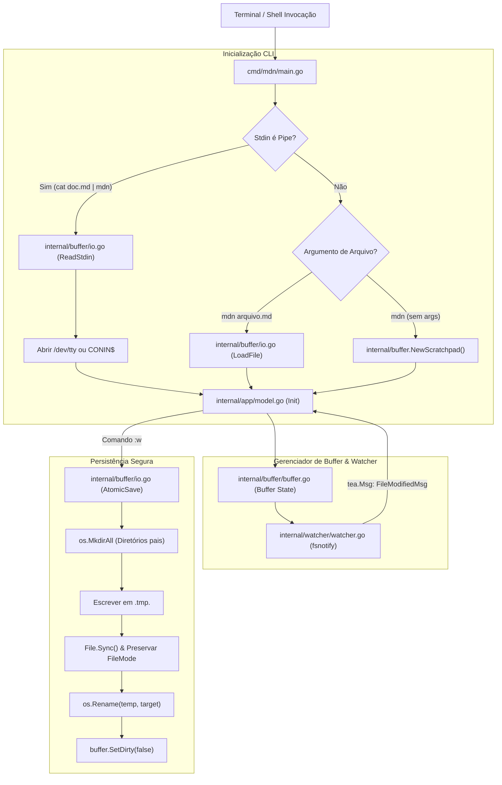

# Especificação Técnica: F01. CLI Entrypoint & File Buffer Manager

## 1. Visão Geral Técnica

### O que será implementado
Implementação do ponto de entrada CLI (`cmd/mdn`), do gerenciador de buffer de texto em memória (`internal/buffer`), do sistema de I/O atômico e seguro de arquivos (`internal/buffer/io.go`), do suporte a leitura via stdin/pipes com reconexão de terminal TTY para o Bubble Tea, do serviço de monitoramento de modificações externas via `fsnotify` (`internal/watcher`) e do modelo base da aplicação Bubble Tea (`internal/app`).

### Motivação Técnica
Como primeira funcionalidade de fundação (**Foundation Feature**), a F01 estabelece a espinha dorsal de execução e integridade de dados do `md-notes`. O editor opera inteiramente em memória e interage com arquivos do sistema operacional, necessitando de:
- Inicialização fria instantânea (< 50 ms).
- Manipulação precisa de caracteres UTF-8 multibyte e preservação fiel de terminações de linha (`\n` e `\r\n`).
- Persistência em disco à prova de falhas com escrita atômica (arquivo temporário + `sync` + `rename`), evitando corrupção de arquivos em caso de falha de energia ou interrupções abruptas.
- Suporte a pipelines CLI (`cat doc.md | mdn`), desconectando a leitura de dados do controle interativo do TUI.
- Notificação não intrusiva de alterações externas de arquivos.

### Escopo

**Incluído (Core + Full Scope):**
- Ponto de entrada CLI `mdn` com suporte a argumentos: `mdn` (scratchpad), `mdn <caminho>` (abrir existente ou novo buffer) e `cat arquivo.md | mdn` (pipe stdin).
- Estrutura de dados `Buffer` baseada em slice de linhas (`[]Line`) indexadas com slices de runes (`[]rune`), garantindo acesso $O(1)$ por linha e manipulação Unicode sem re-encoding.
- Controle de estado modificado (`dirty flag`) e detecção de arquivos novos / stdin.
- Gravação atômica em disco preservando permissões de arquivo originais (`os.FileMode`) e encoding UTF-8.
- Criação automática e recursiva de diretórios pais inexistentes ao gravar caminhos novos (`os.MkdirAll`).
- Bloqueio de saída acidental via `:q` / comandos de fechamento quando houver alterações pendentes, fornecendo mensagem de aviso informativa (`E37`) e suporte a encerramento forçado (`:q!`).
- Monitoramento de alterações externas no arquivo em disco via `fsnotify`: recarregamento automático silencioso se o buffer estiver sem modificações pendentes (`dirty == false`) e aviso não bloqueante se houver modificações locais (`dirty == true`).
- Integração de entrada com Bubble Tea, reconectando `/dev/tty` (Unix) e `CONIN$` (Windows) quando o stdin padrão estiver ocupado com a leitura de pipe.

**Excluído:**
- Motor de comandos e atalhos de navegação modal do Vim (F03).
- Motor de parsing e coloração de sintaxe Markdown (F04).
- Motor de alinhamento e renderização de tabelas (F05).
- Mecanismo interativo de busca e substituição (F06).
- Renderização visual completa de viewport e barra de status estilizada com temas Lipgloss (F07 / F02).

**Preocupações Transversais Integradas:**
- **Contrato de Estado de Buffer:** Disponibilização da interface e structs de `Buffer` para consumo direto por F03 (Vim Engine), F04 (Markdown Parser), F05 (Table Engine), F06 (Search Engine) e F07 (Viewport Renderer).
- **Código de Saída e Mensagens CLI:** Saída limpa para `os.Stderr` com código de saída 1 antes da inicialização do Bubble Tea caso ocorra falha fatal de permissão de leitura.

---

## 2. Impacto na Arquitetura

### Componentes Afetados

| Componente / Arquivo | Tipo | Responsabilidade Principal |
|----------------------|------|---------------------------|
| `cmd/mdn/main.go` | Novo | Ponto de entrada CLI, verificação de pipe stdin, abertura de TTY e inicialização do Bubble Tea |
| `internal/buffer/buffer.go` | Novo | Estrutura de dados do Buffer em memória, inserção, deleção, tracking de dirty state e cursor |
| `internal/buffer/line.go` | Novo | Representação de cada linha (`[]rune`), controle de `LineEnding` (`\n` vs `\r\n`) e conversões |
| `internal/buffer/io.go` | Novo | Carregamento de arquivos, leitura de stdin, escrita atômica com arquivo temporário e criação de diretórios |
| `internal/watcher/watcher.go` | Novo | Monitoramento assíncrono de arquivos em disco com `fsnotify` e emissão de eventos para o Bubble Tea |
| `internal/app/model.go` | Novo | Modelo base do Bubble Tea (`tea.Model`), orquestração inicial de mensagens de buffer, recarregamento e comandos de saída |

### Diagrama de Arquitetura e Fluxo de Dados



---

## 3. Decisões Técnicas

| Decisão | Opção Escolhida | Alternativa Considerada | Trade-off / Justificativa |
|---|---|---|---|
| **Linguagem & Runtime** | Go 1.22+ com Bubble Tea | Rust (Ratatui) / Node.js (Ink) | Go compila binário único nativo estático com cold start < 50ms, consumo < 25MB e facilidade de manutenção de concorrência com goroutines. |
| **Estrutura de Linhas do Buffer** | `[]Line` com `Line` contendo `[]rune` e `LineEnding` | `[]string` simples ou Rope/Piece Table | `[]Line` oferece indexação direta $O(1)$ por linha, manipulação de caracteres Unicode multibyte sem conversões repetidas e preservação exata do line ending original por linha. Rope seria overengineering para documentos < 50k linhas. |
| **Tratamento de Stdin Pipe** | Leitura síncrona de `os.Stdin` até EOF antes de iniciar o TUI, reconectando `tea.WithInput(tty)` para `/dev/tty` ou `CONIN$` | Goroutine de streaming assíncrono durante a renderização | Leitura síncrona antes do TUI garante buffer 100% carregado na inicialização, sem race conditions no cálculo de linhas iniciais, permitindo que o Bubble Tea tome posse total do TTY. |
| **Gravação em Disco** | Escrita atômica via arquivo temporário no mesmo diretório seguida de `Sync` e `Rename` | Sobrescrita direta (`os.WriteFile` / `os.OpenFile(O_TRUNC)`) | A escrita direta pode corromper o arquivo se o processo for interrompido ou o disco encher no meio da gravação. A escrita atômica garante integridade total dos dados. |
| **Criação de Diretórios Pais** | `os.MkdirAll(filepath.Dir(path), 0755)` automático antes do salvamento | Exigir que diretórios existam previamente e falhar | Melhora a ergonomia do usuário ao salvar `:w notas/2026/resumo.md` em pastas ainda não criadas. |
| **Monitoramento Externo** | `fsnotify` integrado emitindo mensagens `tea.Msg` no ciclo do Bubble Tea | Polling manual com `os.Stat` periódico | `fsnotify` utiliza eventos nativos do kernel (kqueue no macOS, inotify no Linux, ReadDirectoryChangesW no Windows) sem consumir CPU em repouso. |

---

## 4. Visão Geral de Componentes

### Módulos e Arquivos

#### 1. `cmd/mdn/main.go`
- **Novo/Modificado:** Novo
- **Propósito:** Ponto de entrada CLI do binário `mdn`.
- **Responsabilidades:**
  - Analisar argumentos de linha de comando (`flag` ou argumentos posicionais).
  - Verificar se a entrada padrão é um pipe (`[os.Stdin.Stat().Mode() & os.ModeCharDevice == 0]`).
  - Ler dados via pipe ou delegar o carregamento do arquivo para o pacote `buffer`.
  - Tratar erros de leitura fatal no console (código de saída 1) antes de entrar em modo gráfico.
  - Inicializar o modelo Bubble Tea com o TTY correto e executar o loop `tea.NewProgram`.

#### 2. `internal/buffer/line.go`
- **Novo/Modificado:** Novo
- **Propósito:** Estrutura e utilitários para representação de linhas de texto.
- **Responsabilidades:**
  - Armazenar o conteúdo da linha como `[]rune`.
  - Armazenar o tipo de terminação de linha `LineEnding` (`LF` ou `CRLF`).
  - Fornecer métodos auxiliares: `Length()`, `String()`, `Bytes()`, `InsertAt(col, r)`, `DeleteAt(col)`.

#### 3. `internal/buffer/buffer.go`
- **Novo/Modificado:** Novo
- **Propósito:** Estrutura central do buffer em memória e manipulação de estado.
- **Responsabilidades:**
  - Gerenciar a lista `[]Line`, posição do cursor (`Cursor { Line, Col }`) e caminho do arquivo (`FilePath`).
  - Manter flags de estado: `IsDirty`, `IsNewFile`, `IsStdinBuffer`, `OriginalModTime`, `OriginalFileMode`.
  - Fornecer métodos de mutação de texto: `InsertText`, `DeleteLine`, `InsertNewLine`, `GetText`, `GetLine(idx)`.
  - Fornecer método `ResetDirty()` e `SetFilePath(newPath)`.

#### 4. `internal/buffer/io.go`
- **Novo/Modificado:** Novo
- **Propósito:** Camada de persistência em disco e leitura de streams.
- **Responsabilidades:**
  - `LoadFromFile(path string) (*Buffer, error)`: Abre e lê o arquivo em UTF-8, detectando terminação de linha.
  - `LoadFromStdin(r io.Reader) (*Buffer, error)`: Lê o stream completo até EOF e inicializa buffer scratchpad nomeado `[Stdin Buffer]`.
  - `AtomicSave(buf *Buffer, targetPath string) error`: Valida se o caminho é válido, cria diretórios pais (`os.MkdirAll`), gera arquivo temporário `.tmp.<rand>`, grava conteúdo UTF-8, executa `Sync()`, preserva permissões (`os.Chmod`) e move com `os.Rename`.

#### 5. `internal/watcher/watcher.go`
- **Novo/Modificado:** Novo
- **Propósito:** Serviço de monitoramento de alterações de arquivo no disco.
- **Responsabilidades:**
  - Gerenciar instância de `fsnotify.Watcher` para o arquivo aberto.
  - Executar goroutine em background que monitora eventos `fsnotify.Write` ou `fsnotify.Remove`.
  - Emitir mensagens `tea.Msg` (`FileModifiedMsg`, `FileDeletedMsg`) para o loop do Bubble Tea.
  - Suspender temporariamente o watcher durante operações locais de `AtomicSave` para evitar falsos positivos de auto-recarregamento.

#### 6. `internal/app/model.go`
- **Novo/Modificado:** Novo
- **Propósito:** Modelo Bubble Tea raiz para gerenciamento de ciclo de vida da aplicação na F01.
- **Responsabilidades:**
  - Implementar `tea.Model` (`Init`, `Update`, `View`).
  - Processar mensagens de teclado para operações de teste/fundação (`:w`, `:q`, `:q!`, `Ctrl+C`).
  - Processar mensagens do watcher (`FileModifiedMsg`): recarregar buffer automaticamente se `!buffer.IsDirty` ou registrar aviso se `buffer.IsDirty`.
  - Controlar encerramento seguro com aviso `E37` em caso de alterações pendentes.

---

## 5. Contratos de Interface & API

*N/A - Aplicação CLI/TUI nativa sem exposição de endpoints de rede HTTP ou RPC.*

### Contratos Internos entre Pacotes (Go Signatures)

```go
package buffer

type LineEnding string

const (
    EndingLF   LineEnding = "\n"
    EndingCRLF LineEnding = "\r\n"
)

type Line struct {
    Runes  []rune
    Ending LineEnding
}

func NewLine(content string, ending LineEnding) Line
func (l *Line) Length() int
func (l *Line) String() string
func (l *Line) Bytes() []byte
func (l *Line) InsertAt(col int, r rune)
func (l *Line) DeleteAt(col int) rune

type Cursor struct {
    Line int // 0-indexed internamente, 1-indexed na UI
    Col  int // 0-indexed internamente, 1-indexed na UI
}

type Buffer struct {
    Lines           []Line
    Cursor          Cursor
    FilePath        string
    IsDirty         bool
    IsNewFile       bool
    IsStdinBuffer   bool
    OriginalModTime time.Time
    OriginalMode    os.FileMode
}

func NewEmptyBuffer(filePath string) *Buffer
func NewScratchpadBuffer() *Buffer
func (b *Buffer) LineCount() int
func (b *Buffer) GetLine(index int) (Line, error)
func (b *Buffer) SetDirty(dirty bool)
func (b *Buffer) SetFilePath(path string)
func (b *Buffer) RawText() string

// I/O Operations
func LoadFromFile(path string) (*Buffer, error)
func LoadFromReader(r io.Reader, name string) (*Buffer, error)
func SaveToFile(buf *Buffer, path string) error
```

---

## 6. Modelo de Dados em Memória

### Estruturas de Dados do Buffer

```go
// Representa metadados e conteúdo integral de um buffer de edição
type Buffer struct {
    // Linhas de texto representadas como slices de runes
    Lines []Line

    // Posição atual do cursor no documento
    Cursor Cursor

    // Caminho absoluto ou relativo do arquivo em disco
    FilePath string

    // Indica se o buffer possui alterações não salvas
    IsDirty bool

    // Indica se o arquivo ainda não existe fisicamente no disco
    IsNewFile bool

    // Indica se o conteúdo foi carregado via pipe stdin
    IsStdinBuffer bool

    // Data de modificação no momento do carregamento (para detecção de conflitos)
    OriginalModTime time.Time

    // Permissões do arquivo original no SO (ex: 0644, 0755)
    OriginalMode os.FileMode
}
```

### Eventos do Bubble Tea (`internal/app` & `internal/watcher`)

```go
// Mensagem emitida quando o arquivo em disco sofre modificação externa
type FileModifiedMsg struct {
    Path    string
    ModTime time.Time
}

// Mensagem emitida para solicitar salvamento de arquivo
type SaveFileMsg struct {
    TargetFilePath string
    Force          bool
}

// Mensagem com o resultado da operação de salvamento
type SaveResultMsg struct {
    Err error
}

// Mensagem para solicitação de encerramento do editor
type QuitMsg struct {
    Force bool
}
```

---

## 7. Estratégia de Testes

### Estrutura de Arquivos de Teste

| Arquivo de Teste | Tipo | Alvo | Meta de Cobertura |
|------------------|------|------|-------------------|
| `internal/buffer/line_test.go` | Unitário | Manipulação de `Line` e runes UTF-8 | 95% |
| `internal/buffer/buffer_test.go` | Unitário | `Buffer` state, dirty tracking, mutações | 90% |
| `internal/buffer/io_test.go` | Integração | I/O de disco, gravação atômica, diretórios, stdin | 95% |
| `internal/watcher/watcher_test.go` | Integração | Detecção de eventos `fsnotify` | 85% |
| `internal/app/model_test.go` | Integração | Ciclo de vida Bubble Tea, `:w`, `:q`, `:q!` e `E37` | 90% |

### Mapeamento de Funções de Teste

#### `internal/buffer/line_test.go`
- `TestLine_CreationAndRunes`: Testa criação de linha com caracteres ASCII, acentuações e emojis UTF-8 multibyte.
- `TestLine_InsertAndDelete`: Testa inserção e remoção de runes em colunas arbitrárias.
- `TestLine_LineEndings`: Valida preservação de `\n` vs `\r\n`.

#### `internal/buffer/buffer_test.go`
- `TestBuffer_EmptyAndScratchpad`: Valida inicialização de buffer vazio e flags iniciais.
- `TestBuffer_DirtyTracking`: Valida alteração de flag `IsDirty` ao modificar linhas e reset em salvamento.

#### `internal/buffer/io_test.go`
- `TestIO_LoadExistingFile`: Abre arquivo existente temporário e valida conteúdo e metadados.
- `TestIO_LoadNonExistentFile`: Valida criação de buffer vazio com flag `IsNewFile = true`.
- `TestIO_LoadFromStdinPipe`: Passa stream `strings.Reader` simulando pipe e valida carregamento.
- `TestIO_AtomicSave_Success`: Grava buffer, valida criação atômica e integridade dos bytes em disco.
- `TestIO_AtomicSave_PreservesFileMode`: Cria arquivo com permissão `0755`, salva via buffer e valida que `0755` foi mantido.
- `TestIO_AtomicSave_CreatesParentDirs`: Salva em `sub/dir/nested/doc.md` e valida criação automática dos diretórios.
- `TestIO_LoadPermissionDenied`: Simula leitura de arquivo sem permissão (`0000`) e valida erro retornado.
- `TestIO_SaveWithoutPath_Error`: Tenta salvar buffer scratchpad sem caminho e valida mensagem de erro.

#### `internal/watcher/watcher_test.go`
- `TestWatcher_ExternalModification`: Modifica arquivo externamente no disco e valida recebimento de `FileModifiedMsg`.
- `TestWatcher_IgnoreSelfSave`: Executa `AtomicSave` e valida que o watcher ignora a própria escrita.

#### `internal/app/model_test.go`
- `TestApp_QuitCleanBuffer`: Executa `:q` com buffer sem modificações e valida encerramento com sucesso (`tea.Quit`).
- `TestApp_QuitDirtyBuffer_Blocked`: Executa `:q` com buffer modificado e valida bloqueio com aviso `E37`.
- `TestApp_QuitForceDirtyBuffer`: Executa `:q!` com buffer modificado e valida encerramento imediato.
- `TestApp_ExternalReload_CleanBuffer`: Recebe `FileModifiedMsg` com buffer limpo e valida recarregamento automático.
