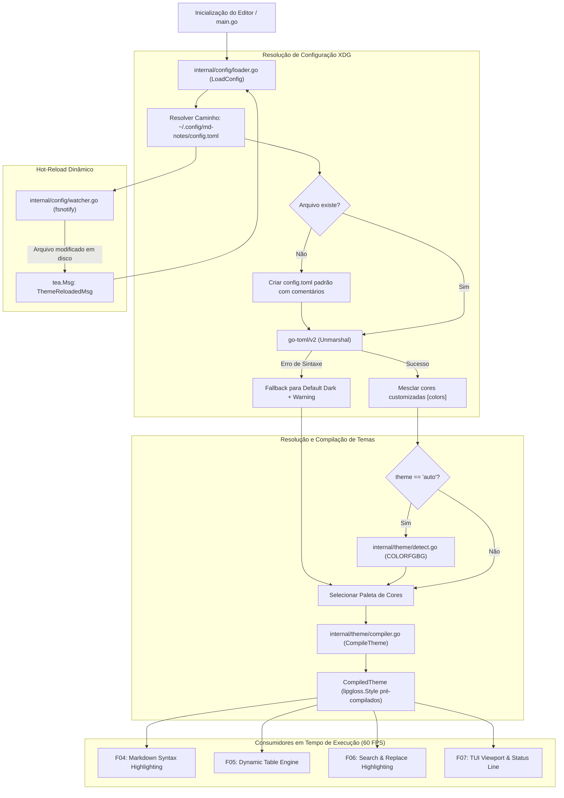

# Especificação Técnica: F02. Configuration & Theme Engine

## 1. Visão Geral Técnica

### O que será implementado
Implementação do motor de configuração e temas (`internal/config` e `internal/theme`), responsável pelo carregamento e validação de arquivos TOML em conformidade com as especificações XDG do sistema operacional (`~/.config/md-notes/config.toml` no Linux/macOS e `%APPDATA%\md-notes\config.toml` no Windows), criação automática do arquivo de configuração padrão documentado, registro de 7 temas pré-definidos (`dracula`, `nord`, `catppuccin-mocha`, `catppuccin-macchiato`, `monokai`, `default-dark`, `default-light`), customização granular de cores via Hex (`#RRGGBB`) ou ANSI 256, compilação de alta performance de estilos Lipgloss em `CompiledTheme`, hot-reload dinâmico com `fsnotify` e detecção automática de modo claro/escuro do terminal.

### Motivação Técnica
Como segunda funcionalidade de fundação (**Foundation Feature**), a F02 provê a infraestrutura central de identidade visual e parametrização do editor `md-notes`. É fundamental que o motor de estilos:
- Inicialize e compile todos os estilos Lipgloss em menos de 5 ms, evitando overhead no cold start (< 50 ms).
- Disponibilize uma estrutura imutável de estilos pré-compilados (`CompiledTheme`) com tempo de acesso $O(1)$ por token, eliminando alocações dinâmicas de memória durante os loops de renderização do Bubble Tea a 60 FPS (F04, F05, F06, F07).
- Garanta tolerância a falhas: erros de sintaxe no TOML nunca devem impedir a inicialização do editor (fallback seguro e resiliente para `default-dark`).
- Suporte hot-reload assíncrono para que alterações visuais no `config.toml` sejam refletidas instantaneamente sem necessidade de reiniciar o editor.

### Escopo

**Incluído (Core + Full Scope):**
- Resolução de caminhos de configuração conforme padrão XDG / AppData por sistema operacional.
- Geração automática do arquivo `config.toml` padrão documentado e comentado caso não exista.
- Parser e serialização TOML com tipagem estrita via `github.com/pelletier/go-toml/v2`.
- Fallback seguro para o tema padrão `default-dark` em caso de arquivo corrompido, chaves desconhecidas ou sintaxe inválida, com emissão de alerta não bloqueante.
- 7 temas embutidos completos: `dracula`, `nord`, `catppuccin-mocha`, `catppuccin-macchiato`, `monokai`, `default-dark`, `default-light`.
- Suporte a sobreposição (override) de cores em formato Hex (`#RRGGBB`) e ANSI 256 na seção `[colors]` do TOML.
- Estrutura `CompiledTheme` com instâncias pré-compiladas `lipgloss.Style` para títulos (H1 a H6), marcadores atenuados (dimmed), negrito, itálico, código inline, blocos de código, bordas de tabela, cabeçalhos, cursor, barra de status e destaques de busca.
- Hot-reload do arquivo de configuração em tempo real via watcher `fsnotify`, emitindo mensagens `tea.Msg` (`ThemeReloadedMsg`) para o Bubble Tea.
- Detecção automática de modo claro/escuro do terminal (`theme = "auto"`) via variáveis de ambiente (`COLORFGBG`) e perfil do terminal.
- Parâmetros booleanos e numéricos para exibição de numeração de linhas (`line_numbers = true`) e tamanho de tabulação (`tab_size = 4`).

**Excluído:**
- Aplicação visual direta das cores no texto de Markdown (F04).
- Aplicação das bordas estilizadas no renderizador de tabelas (F05).
- Destacamento visual do prompt de busca (F06).
- Montagem do layout da barra de status e viewport do editor (F07).

**Preocupações Transversais Integradas:**
- **Contrato de Estilos:** Exportação de `CompiledTheme` e `Config` para consumo unificado por F04 (Markdown Parser), F05 (Table Engine), F06 (Search Engine) e F07 (Viewport Renderer).
- **Notificação de Erro na Status Bar:** Registro de avisos não bloqueantes no estado da aplicação quando o arquivo TOML apresentar falhas de parse.

---

## 2. Impacto na Arquitetura

### Componentes Afetados

| Componente / Arquivo | Tipo | Responsabilidade Principal |
|----------------------|------|---------------------------|
| `internal/config/config.go` | Novo | Definição das structs de configuração, resolução de caminhos XDG e valores padrão |
| `internal/config/loader.go` | Novo | Leitura do TOML, tratamento de fallback em erros e criação automática do arquivo padrão |
| `internal/theme/palette.go` | Novo | Definição dos 7 temas embutidos (Dracula, Nord, Catppuccin, Monokai, etc.) e mapeamento de cores |
| `internal/theme/compiler.go`| Novo | Compilação de cores e atributos tipográficos em instâncias otimizadas de `lipgloss.Style` (`CompiledTheme`) |
| `internal/theme/detect.go`  | Novo | Detecção de tema claro/escuro (`auto`) baseada em `COLORFGBG` e parâmetros de terminal |
| `internal/config/watcher.go`| Novo | Monitoramento de modificações no `config.toml` com `fsnotify` e disparo de `ThemeReloadedMsg` |

### Diagrama de Arquitetura e Fluxo de Dados



---

## 3. Decisões Técnicas

| Decisão | Opção Escolhida | Alternativa Considerada | Trade-off / Justificativa |
|---|---|---|---|
| **Parser TOML** | `github.com/pelletier/go-toml/v2` | `github.com/BurntSushi/toml` ou JSON/YAML | `pelletier/go-toml/v2` é até 5x mais rápido no unmarshal, zero-allocation em campos conhecidos e possui validação estrita com excelente feedback de erros de parsing. |
| **Cache e Compilação de Estilos** | `CompiledTheme` com instâncias `lipgloss.Style` imutáveis pré-compiladas | Instanciar `lipgloss.NewStyle()` sob demanda a cada renderização de token | Pré-compilar todos os estilos na inicialização/reload reduz o custo de renderização por frame para acesso $O(1)$ a structs, eliminando chamadas repetidas a compiladores de escape ANSI e permitindo renderização estável a 60 FPS. |
| **Resolução de Diretórios de Configuração** | `os.UserConfigDir()` (`~/.config/md-notes` no Linux/macOS e `%APPDATA%\md-notes` no Windows) | Caminho fixo no diretório home `~/.mdnotes.toml` | Segue os padrões modernos XDG Base Directory Specification no Linux/Unix e convenções nativas do Windows, mantendo a home limpa e integrando perfeitamente com dotfiles. |
| **Resiliência e Fallback de Erro** | Fallback seguro para tema embutido `default-dark` e registro de aviso de erro de sintaxe | Encerrar o aplicativo (panic/fatal exit) com código de erro | Usuários não devem ser impedidos de abrir ou editar notas no terminal caso haja um typo no arquivo de configuração. O editor abre normalmente e notifica o problema. |
| **Hot-Reload de Configuração** | Goroutine com `fsnotify` monitorando o arquivo de configuração com debounce de 50ms | Polling de timestamp com `os.Stat` periódico | `fsnotify` consome 0% de CPU em repouso e entrega atualização em tempo real; debounce de 50ms previne reloads intermediários durante salvamento por editores de texto. |
| **Detecção de Dark/Light Mode** | Leitura de `COLORFGBG` e perfil do terminal | Forçar apenas tema escuro | Proporciona suporte contínuo para usuários de terminais com fundo claro quando `theme = "auto"` for configurado, selecionando `default-light` ou `default-dark` automaticamente. |

---

## 4. Visão Geral de Componentes

### Módulos e Arquivos

#### 1. `internal/config/config.go`
- **Novo/Modificado:** Novo
- **Propósito:** Estruturas de dados de configuração e definição de defaults.
- **Responsabilidades:**
  - Definir structs: `Config`, `EditorConfig`, `ThemeConfig`, `ColorOverrides`.
  - Definir valores padrão recomendados (`default-dark`, `tab_size = 4`, `line_numbers = true`).
  - Obter caminho XDG padronizado: `GetConfigFilePath() (string, error)`.

#### 2. `internal/config/loader.go`
- **Novo/Modificado:** Novo
- **Propósito:** Carregador e validador de arquivos TOML.
- **Responsabilidades:**
  - `LoadConfig() (*Config, error)`: Carrega o arquivo do disco ou gera fallback.
  - `EnsureDefaultConfigFile(path string) error`: Gera o arquivo `config.toml` padrão ricamente documentado com comentários caso não exista.
  - `ParseTOML(data []byte) (*Config, error)`: Valida e desserializa o TOML.

#### 3. `internal/theme/palette.go`
- **Novo/Modificado:** Novo
- **Propósito:** Definição das paletas de cores dos temas embutidos.
- **Responsabilidades:**
  - Armazenar definições de cores para os 7 temas:
    - `dracula`
    - `nord`
    - `catppuccin-mocha`
    - `catppuccin-macchiato`
    - `monokai`
    - `default-dark`
    - `default-light`
  - Estrutura `Palette` contendo tokens: `Primary`, `Secondary`, `Background`, `Foreground`, `Muted`, `H1` a `H6`, `Bold`, `Italic`, `CodeBg`, `CodeFg`, `TableBorder`, `TableHeader`, `StatusBarBg`, `StatusBarFg`, `SearchMatchBg`, `SearchMatchFg`, `CursorBg`.
  - `GetPalette(themeName string) (Palette, bool)`: Recupera a paleta por nome.

#### 4. `internal/theme/compiler.go`
- **Novo/Modificado:** Novo
- **Propósito:** Compilador de estilos Lipgloss de alta eficiência.
- **Responsabilidades:**
  - Aplicar sobreposições de cores customizadas da struct `ColorOverrides` sobre a paleta base.
  - `CompileTheme(palette Palette) *CompiledTheme`: Instancia e armazena todos os `lipgloss.Style` necessários.
  - Fornecer estilos prontos para consumo imediato.

#### 5. `internal/theme/detect.go`
- **Novo/Modificado:** Novo
- **Propósito:** Detecção de perfil claro/escuro do emulador de terminal.
- **Responsabilidades:**
  - Inspecionar a variável de ambiente `COLORFGBG` (ex: `15;0` = escuro, `0;15` = claro).
  - Determinar se o tema `auto` deve resolver para `default-dark` ou `default-light`.

#### 6. `internal/config/watcher.go`
- **Novo/Modificado:** Novo
- **Propósito:** Monitoramento dinâmico do arquivo de configuração para hot-reload.
- **Responsabilidades:**
  - Iniciar monitoramento via `fsnotify.Watcher` no diretório de configuração.
  - Aplicar debounce de 50ms para evitar múltiplos eventos em escrita de arquivo.
  - Despachar mensagem `ThemeReloadedMsg` com a nova configuração e tema compilado para o programa Bubble Tea.

---

## 5. Contratos de Interface & API

*N/A - Aplicação CLI/TUI nativa sem exposição de endpoints de rede HTTP ou RPC.*

### Contratos Internos entre Pacotes (Go Signatures)

```go
package config

import (
    "github.com/charmbracelet/lipgloss"
    "github.com/pelletier/go-toml/v2"
)

type EditorConfig struct {
    TabSize     int  `toml:"tab_size"`
    LineNumbers bool `toml:"line_numbers"`
}

type ColorOverrides struct {
    H1            string `toml:"h1,omitempty"`
    H2            string `toml:"h2,omitempty"`
    H3            string `toml:"h3,omitempty"`
    H4            string `toml:"h4,omitempty"`
    H5            string `toml:"h5,omitempty"`
    H6            string `toml:"h6,omitempty"`
    Muted         string `toml:"muted,omitempty"`
    Bold          string `toml:"bold,omitempty"`
    Italic        string `toml:"italic,omitempty"`
    CodeBg        string `toml:"code_bg,omitempty"`
    CodeFg        string `toml:"code_fg,omitempty"`
    TableBorder   string `toml:"table_border,omitempty"`
    TableHeader   string `toml:"table_header,omitempty"`
    StatusBarBg   string `toml:"status_bar_bg,omitempty"`
    StatusBarFg   string `toml:"status_bar_fg,omitempty"`
    SearchMatchBg string `toml:"search_match_bg,omitempty"`
    SearchMatchFg string `toml:"search_match_fg,omitempty"`
}

type Config struct {
    Theme   string         `toml:"theme"`
    Editor  EditorConfig   `toml:"editor"`
    Colors  ColorOverrides `toml:"colors"`
}

func DefaultConfig() *Config
func GetConfigDir() (string, error)
func GetConfigFilePath() (string, error)
func LoadConfig() (*Config, []string, error) // Retorna config, warnings e erro fatal (se houver)
func EnsureDefaultConfigFile(filePath string) error
```

```go
package theme

import "github.com/charmbracelet/lipgloss"

type Palette struct {
    Name          string
    IsDark        bool
    H1            string
    H2            string
    H3            string
    H4            string
    H5            string
    H6            string
    Muted         string
    Bold          string
    Italic        string
    CodeBg        string
    CodeFg        string
    TableBorder   string
    TableHeader   string
    StatusBarBg   string
    StatusBarFg   string
    SearchMatchBg string
    SearchMatchFg string
    CursorBg      string
}

type CompiledTheme struct {
    Palette       Palette
    H1            lipgloss.Style
    H2            lipgloss.Style
    H3            lipgloss.Style
    H4            lipgloss.Style
    H5            lipgloss.Style
    H6            lipgloss.Style
    Muted         lipgloss.Style
    Bold          lipgloss.Style
    Italic        lipgloss.Style
    CodeBlock     lipgloss.Style
    CodeInline    lipgloss.Style
    TableBorder   lipgloss.Style
    TableHeader   lipgloss.Style
    TableCell     lipgloss.Style
    StatusBar     lipgloss.Style
    StatusBarMode lipgloss.Style
    SearchMatch   lipgloss.Style
    LineNumber    lipgloss.Style
    ActiveLineNo  lipgloss.Style
}

func GetPalette(themeName string) (Palette, bool)
func CompileTheme(palette Palette, overrides config.ColorOverrides) *CompiledTheme
func ResolveThemeName(configuredTheme string) string
```

---

## 6. Modelo de Dados e Configuração

### Exemplo do Arquivo de Configuração Padrão Gerado (`config.toml`)

```toml
# md-notes - Arquivo de Configuração do Usuário
# Localização padrão: ~/.config/md-notes/config.toml (Linux/macOS) ou %APPDATA%/md-notes/config.toml (Windows)

# Tema visual ativo.
# Opções disponíveis: "default-dark", "default-light", "dracula", "nord", "catppuccin-mocha", "catppuccin-macchiato", "monokai", "auto"
theme = "default-dark"

[editor]
# Largura da tabulação em espaços (padrão: 4)
tab_size = 4

# Exibição de numeração de linhas na lateral esquerda
line_numbers = true

[colors]
# Sobreposição granular de cores (códigos Hex #RRGGBB ou ANSI 256). Descomente para customizar.
# h1 = "#BD93F9"
# h2 = "#8BE9FD"
# h3 = "#50FA7B"
# muted = "#6272A4"
# bold = "#FF79C6"
# italic = "#F1FA8C"
# code_bg = "#282A36"
# code_fg = "#F8F8F2"
# table_border = "#6272A4"
# table_header = "#BD93F9"
# status_bar_bg = "#44475A"
# status_bar_fg = "#F8F8F2"
# search_match_bg = "#F1FA8C"
# search_match_fg = "#282A36"
```

### Eventos do Bubble Tea (`internal/config` & `internal/theme`)

```go
// Mensagem emitida quando o arquivo de configuração é recarregado com sucesso em disco
type ThemeReloadedMsg struct {
    Config        *config.Config
    CompiledTheme *theme.CompiledTheme
    Warning       string
}
```

---

## 7. Estratégia de Testes

### Estrutura de Arquivos de Teste

| Arquivo de Teste | Tipo | Alvo | Meta de Cobertura |
|------------------|------|------|-------------------|
| `internal/config/config_test.go` | Unitário | Resolução de caminhos XDG e valores padrão | 95% |
| `internal/config/loader_test.go` | Unitário / Integração | Leitura de TOML, fallbacks de erro e criação de arquivo padrão | 95% |
| `internal/theme/palette_test.go` | Unitário | Verificação e integridade dos 7 temas incorporados | 100% |
| `internal/theme/compiler_test.go`| Unitário | Compilação de estilos Lipgloss e aplicação de overrides Hex/ANSI | 95% |
| `internal/theme/detect_test.go`  | Unitário | Detecção de modo claro/escuro via `COLORFGBG` | 90% |
| `internal/config/watcher_test.go`| Integração | Hot-reload via `fsnotify` ao alterar `config.toml` | 90% |

### Mapeamento de Funções de Teste

#### `internal/config/config_test.go`
- `TestConfig_Defaults`: Valida que `DefaultConfig()` retorna `theme = "default-dark"`, `tab_size = 4` e `line_numbers = true`.
- `TestConfig_XDGPathResolution`: Valida resolução de caminhos em diferentes plataformas (Linux, macOS, Windows).

#### `internal/config/loader_test.go`
- `TestLoader_EnsureDefaultFileCreated`: Testa criação automática de `config.toml` quando o arquivo não existe previamente.
- `TestLoader_ParseValidTOML`: Carrega arquivo TOML válido e valida deserialização correta de todos os campos.
- `TestLoader_ParseSyntaxError_Fallback`: Fornece TOML com erro de sintaxe (`theme = [invalido`) e valida fallback resiliente para `default-dark` com mensagem de aviso.
- `TestLoader_ParseUnknownTheme_Fallback`: Configura tema inexistente (`theme = "fantasma"`) e valida fallback seguro.

#### `internal/theme/palette_test.go`
- `TestPalette_BuiltinThemesExist`: Valida a presença dos 7 temas pré-definidos (`dracula`, `nord`, `catppuccin-mocha`, `catppuccin-macchiato`, `monokai`, `default-dark`, `default-light`).
- `TestPalette_ColorTokensComplete`: Valida que nenhum tema possui tokens de cor vazios ou nulos.

#### `internal/theme/compiler_test.go`
- `TestCompiler_CompileTheme_Success`: Valida que `CompileTheme` gera instâncias `lipgloss.Style` válidas para todos os componentes.
- `TestCompiler_ApplyColorOverrides`: Testa sobreposição de cores em Hex (`#FF0000`) em `H1` e valida que o estilo compilado reflete a cor customizada.
- `TestCompiler_Performance`: Mede o tempo de compilação de tema completo, garantindo execução em menos de 5 ms.

#### `internal/theme/detect_test.go`
- `TestDetect_COLORFGBG_Dark`: Simula `COLORFGBG="15;0"` e valida resolução para tema escuro.
- `TestDetect_COLORFGBG_Light`: Simula `COLORFGBG="0;15"` e valida resolução para tema claro.

#### `internal/config/watcher_test.go`
- `TestWatcher_HotReload_ThemeChange`: Modifica o arquivo `config.toml` em tempo de execução e valida disparo de `ThemeReloadedMsg` com novo tema compilado.
