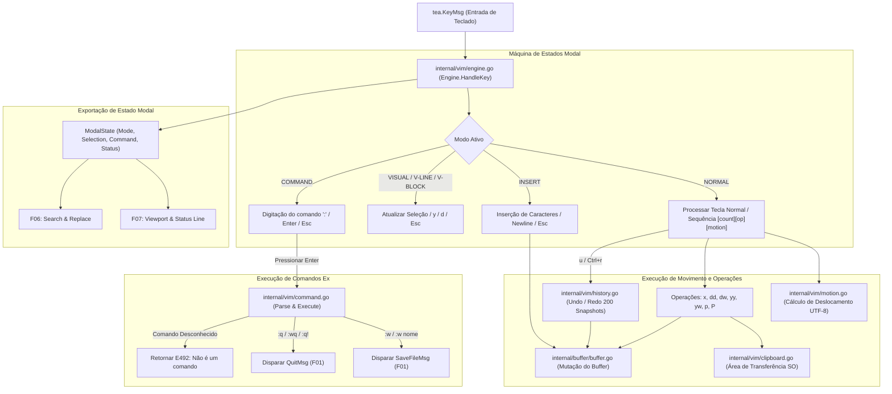

# Especificação Técnica: F03. Modal Editing Engine (Vim Emulation)

## 1. Visão Geral Técnica

### O que será implementado
Implementação da máquina de estados modal inspirada no padrão Vim (`internal/vim`), responsável pelo controle de modos de edição (`NORMAL`, `INSERT`, `VISUAL`, `VISUAL LINE`, `VISUAL BLOCK`, `COMMAND`), sistema de movimentação precisa do cursor (`h`, `j`, `k`, `l`, `w`, `b`, `0`, `$`, `gg`, `G`, buscas na linha `f/F/t/T`), operadores de edição e deleção (`x`, `dd`, `dw`, `yy`, `yw`, `p`, `P`, `o`, `O`, `i`, `a`, `I`, `A`), suporte a contadores numéricos de repetição (ex: `5j`, `3dd`, `10w`), pilha de histórico de Undo/Redo com até 200 checkpoints imutáveis, sincronização bidirecional com a área de transferência do sistema operacional (`github.com/atotto/clipboard`) e interpretador de comandos ex (`:w`, `:q`, `:wq`, `:q!`, `:w <nome>`, salto de linha `:<numero>`).

### Motivação Técnica
O diferencial ergonômico do `md-notes` reside na fluidez de navegação sem mouse para desenvolvedores acostumados com atalhos de terminal e Vim. Para assegurar máxima fidelidade:
- As transições de modo e execução de comandos de teclado devem ocorrer com latência inferior a 1 milissegundo.
- O deslocamento e posicionamento do cursor devem operar sobre coordenadas de caracteres Unicode/runes UTF-8 (F01), garantindo que acentuações e caracteres multibyte não quebrem o alinhamento.
- A pilha de desfazer e refazer deve manter histórico determinístico e isolado por buffer, permitindo reverter sessões de digitação ou operações atômicas com segurança.
- O estado modal ativo deve ser exposto de forma limpa para integração direta com a barra de status e viewport (F07) e o sistema de busca (F06).

### Escopo

**Incluído (Core + Full Scope):**
- Máquina de estados completa com 6 modos: Normal, Insert, Visual (por caractere), Visual Line (por linha inteira), Visual Block (retangular em bloco `Ctrl+v`), e Command-line (`:`).
- Movimentação no modo Normal:
  - Básica: `h` (esquerda), `j` (baixo), `k` (cima), `l` (direita).
  - Por palavras: `w` (próxima palavra), `b` (palavra anterior).
  - Por limites de linha e documento: `0` (início da linha), `$` (fim da linha), `gg` (início do buffer), `G` (fim do buffer).
  - Buscas inline na linha ativa: `f<char>` (ir até caractere à direita), `F<char>` (ir até caractere à esquerda), `t<char>` (ir antes do caractere à direita), `T<char>` (ir antes do caractere à esquerda).
  - Contadores numéricos prefixados: qualquer comando de movimento ou operador aceita multiplicadores inteiros (ex: `5j`, `10w`, `3dd`).
- Comandos de transição para modo Insert:
  - `i` (inserir antes do cursor), `a` (inserir após o cursor).
  - `I` (inserir no início da linha), `A` (inserir no final da linha).
  - `o` (abrir nova linha abaixo), `O` (abrir nova linha acima).
  - `Esc` (retornar ao modo Normal e registrar checkpoint de Undo).
- Operações de edição, cópia e colagem:
  - `x` (apagar caractere sob o cursor).
  - `dd` (apagar linha inteira e copiar para registrador), `dw` (apagar palavra e copiar para registrador).
  - `yy` (copiar linha inteira), `yw` (copiar palavra).
  - `p` (colar conteúdo do registrador após o cursor/linha), `P` (colar antes do cursor/linha).
  - Em modos Visuais: `y` (copiar seleção para o registrador e retornar a Normal), `d` ou `x` (apagar texto selecionado e copiar para registrador).
- Sincronização automática com a área de transferência do sistema operacional (`clipboard`) para todas as ações de `y`, `yy`, `d`, `dd`, `x` e `p`, mantendo fallback em memória.
- Pilha circular de Undo (`u`) e Redo (`Ctrl+r`) com até 200 snapshots imutáveis do buffer por sessão.
- Linha de comando Ex (`:`): suporte a `:w`, `:w <caminho>`, `:q`, `:wq`, `:q!`, e salto de linha `:<num>` com validação estrita de erros (`E492`).

**Excluído:**
- Modo de busca interativa `/` e substituição regex `:%s` (delegado para F06).
- Renderização visual estilizada do cursor e indicadores Lipgloss da barra de status (delegado para F07).
- Realce de sintaxe Markdown e blocos de código (delegado para F04).

**Preocupações Transversais Integradas:**
- **Consumo do Buffer State (F01):** Leitura e manipulação atômica de `[]Line`, `Cursor`, `IsDirty` e invocação de `AtomicSave`.
- **Fornecimento de Modal State:** Exposição de `Mode`, `Selection`, `CommandInput`, `PendingOperator` e `Count` para consumo por F06 (Search) e F07 (Status Line & Viewport).

---

## 2. Impacto na Arquitetura

### Componentes Afetados

| Componente / Arquivo | Tipo | Responsabilidade Principal |
|----------------------|------|---------------------------|
| `internal/vim/state.go` | Novo | Definição dos tipos de modo (`Mode`), seleção visual (`Selection`), registrador (`Register`) e estado modal |
| `internal/vim/engine.go` | Novo | Despachante de eventos de teclado, máquina de estados e processamento de sequências (`[count]`, prefixos `d`, `y`, `g`, `f`) |
| `internal/vim/motion.go` | Novo | Algoritmos de navegação (`h/j/k/l`, `w/b`, `0/$`, `gg/G`, `f/F/t/T`) sobre coordenadas de runes |
| `internal/vim/history.go` | Novo | Pilha circular de snapshots para Undo (`u`) e Redo (`Ctrl+r`) com limite de 200 estados |
| `internal/vim/clipboard.go` | Novo | Abstração e sincronização com o clipboard do SO via `atotto/clipboard` e fallback em memória |
| `internal/vim/command.go` | Novo | Interpretador de comandos ex (`:w`, `:q`, `:wq`, `:q!`, `:<linha>`) e formatação de erros `E492` |
| `internal/app/model.go` | Modificado | Integração do `Engine` do Vim com o ciclo de atualização (`Update`) e renderização (`View`) do Bubble Tea |

### Diagrama de Arquitetura e Fluxo de Dados



---

## 3. Decisões Técnicas

| Decisão | Opção Escolhida | Alternativa Considerada | Trade-off / Justificativa |
|---|---|---|---|
| **Arquitetura de Undo/Redo** | Snapshots imutáveis completos do buffer com cópia estrutural e limite circular de 200 checkpoints | Command Pattern com deltas reversíveis (inversão de inserções/deleções) | Snapshots garantem reversibilidade determinística $O(1)$ sem risco de desincronização em documentos complexos; para notas de até 50k linhas em Go, a alocação de ponteiros para structs de linhas é extremamente eficiente (< 15 MB). |
| **Agrupamento de Undo no Modo Insert** | Um snapshot é criado ao entrar no modo Insert e confirmado ao sair com `Esc` | Gravar cada tecla digitada como um passo de undo individual | No Vim padrão, toda a sessão de digitação contínua dentro do modo Insert é desfeita como uma única unidade atômica ao pressionar `u`. |
| **Integração de Clipboard** | `github.com/atotto/clipboard` com fallback para registrador em memória | Execução direta via `os/exec` (`pbcopy`, `xclip`) | `atotto/clipboard` encapsula os mecanismos CGO e CLI nativos de macOS, Linux e Windows com alta performance e sem dependências manuais externas. |
| **Contadores Numéricos (Counts)** | Acumulador numérico com parser de múltiplos dígitos (ex: `12j`, `3dd`) | Suportar apenas repetição simples de 1 dígito (1-9) | Permite salto exato de linhas e repetição de comandos compostos conforme a especificação do Vim. |
| **Navegação por Palavras (w/b)** | Algoritmo baseado em categorias de caracteres Unicode (Alfanumérico, Pontuação, Espaço em branco) | Split simples por espaço em branco `strings.Fields` | Permite parar o cursor em delimitadores de Markdown e símbolos (`#`, `[`, `]`, `(`, `)`), fundamental para navegação técnica. |

---

## 4. Visão Geral de Componentes

### Módulos e Arquivos

#### 1. `internal/vim/state.go`
- **Novo/Modificado:** Novo
- **Propósito:** Definição dos tipos de modo, seleções e structs de estado modal.
- **Responsabilidades:**
  - Enum `Mode`: `ModeNormal`, `ModeInsert`, `ModeVisualChar`, `ModeVisualLine`, `ModeVisualBlock`, `ModeCommand`.
  - Struct `Position { Line, Col }` e `Selection { Start Position, End Position, Type Mode }`.
  - Struct `Register` contendo texto copiado/deletado e flag `IsLineWise`.
  - Struct `ModalState` expondo o estado para outros componentes.

#### 2. `internal/vim/engine.go`
- **Novo/Modificado:** Novo
- **Propósito:** Máquina de estados principal e processador de sequências de teclado.
- **Responsabilidades:**
  - `HandleKey(msg tea.KeyMsg) (tea.Cmd, string)`: Interpreta teclas de acordo com o modo atual.
  - Gerenciar buffer de prefixos (`pendingOp`: `'d'`, `'y'`, `'g'`, `'f'`, `'F'`, `'t'`, `'T'`).
  - Acumular multiplicadores numéricos (`count`).
  - Gerenciar transições entre Normal, Insert, Visual e Command.

#### 3. `internal/vim/motion.go`
- **Novo/Modificado:** Novo
- **Propósito:** Cálculo e aplicação de movimentos do cursor.
- **Responsabilidades:**
  - Movimentos direcionais: `MoveLeft`, `MoveRight`, `MoveDown`, `MoveUp`.
  - Movimentos por palavra: `NextWordStart(w)`, `PrevWordStart(b)`.
  - Movimentos de início/fim: `LineStart(0)`, `LineEnd($)`, `DocStart(gg)`, `DocEnd(G)`.
  - Buscas na linha: `FindCharForward(f)`, `FindCharBackward(F)`, `TillCharForward(t)`, `TillCharBackward(T)`.

#### 4. `internal/vim/history.go`
- **Novo/Modificado:** Novo
- **Propósito:** Pilha de histórico de edição para Undo e Redo.
- **Responsabilidades:**
  - Struct `History` com anel circular de até 200 instâncias de `Snapshot`.
  - `Push(buf *buffer.Buffer)`: Registra novo estado no histórico e limpa a pilha de redo.
  - `Undo(buf *buffer.Buffer) error`: Reverte para o estado anterior.
  - `Redo(buf *buffer.Buffer) error`: Reaplica o próximo estado revertido.

#### 5. `internal/vim/clipboard.go`
- **Novo/Modificado:** Novo
- **Propósito:** Sincronização com a área de transferência do SO e registrador local.
- **Responsabilidades:**
  - `Set(text string, isLineWise bool)`: Salva no registrador interno e no clipboard do SO.
  - `Get() (string, bool)`: Lê do clipboard do SO (ou fallback do registrador interno).

#### 6. `internal/vim/command.go`
- **Novo/Modificado:** Novo
- **Propósito:** Interpretador e despachante da linha de comandos Ex (`:`).
- **Responsabilidades:**
  - Analisar string de comando digitada após `:` (`w`, `q`, `wq`, `q!`, `w <nome>`, `<numero>`).
  - Retornar erros formatados (`E492: Não é um comando de editor: <cmd>`).

#### 7. `internal/app/model.go`
- **Novo/Modificado:** Modificado
- **Propósito:** Integrar o `vim.Engine` no loop do Bubble Tea.
- **Responsabilidades:**
  - Delegar `tea.KeyMsg` para `Engine.HandleKey`.
  - Exibir prompt `:` na linha inferior quando em `ModeCommand`.
  - Atualizar visualização do cursor e status textuais.

---

## 5. Contratos de Interface & API

*N/A - Aplicação CLI/TUI nativa sem exposição de endpoints de rede HTTP ou RPC.*

### Contratos Internos entre Pacotes (Go Signatures)

```go
package vim

import (
    tea "github.com/charmbracelet/bubbletea"
    "md-notes/internal/buffer"
)

type Mode int

const (
    ModeNormal Mode = iota
    ModeInsert
    ModeVisualChar
    ModeVisualLine
    ModeVisualBlock
    ModeCommand
)

func (m Mode) String() string

type Position struct {
    Line int
    Col  int
}

type Selection struct {
    Start Position
    End   Position
    Type  Mode
}

type ModalState struct {
    CurrentMode  Mode
    Selection    *Selection
    CommandInput string
    StatusMsg    string
    Count        int
}

type Engine struct {
    Buffer    *buffer.Buffer
    History   *History
    Clipboard *Clipboard
    State     ModalState
}

func NewEngine(buf *buffer.Buffer) *Engine
func (e *Engine) HandleKey(msg tea.KeyMsg) (tea.Cmd, string)
func (e *Engine) GetModalState() ModalState
func (e *Engine) SetMode(m Mode)
```

---

## 6. Modelo de Dados em Memória

### Estruturas de Dados do Vim Engine

```go
// Snapshot imutável do buffer para restauração em Undo/Redo
type Snapshot struct {
    Lines    []buffer.Line
    Cursor   buffer.Cursor
    IsDirty  bool
    FilePath string
}

// Histórico circular com capacidade máxima de 200 estados
type History struct {
    snapshots []Snapshot
    current   int
    maxSize   int
}

// Registrador de cópia/deleção
type Register struct {
    Content    string
    IsLineWise bool
}
```

---

## 7. Estratégia de Testes

### Estrutura de Arquivos de Teste

| Arquivo de Teste | Tipo | Alvo | Meta de Cobertura |
|------------------|------|------|-------------------|
| `internal/vim/motion_test.go` | Unitário | Movimentação `h/j/k/l`, `w/b`, `0/$`, `gg/G`, `f/F/t/T` e counts | 95% |
| `internal/vim/history_test.go`| Unitário | Pilha de Undo (`u`), Redo (`Ctrl+r`) e limite de 200 snapshots | 95% |
| `internal/vim/clipboard_test.go`| Unitário | Sincronização do registrador e fallback | 90% |
| `internal/vim/command_test.go`| Unitário | Parser de comandos ex (`:w`, `:q`, `:wq`, `:q!`, `E492`) | 95% |
| `internal/vim/engine_test.go` | Integração | Máquina de estados, transições de modo, `x`, `dd`, `dw`, `yy`, `p` e visual | 95% |
| `internal/app/model_vim_test.go`| Integração | Delegação de teclas no Bubble Tea e renderização do prompt `:` | 90% |

### Mapeamento de Funções de Teste

#### `internal/vim/motion_test.go`
- `TestMotion_BasicDirections`: Valida `h`, `j`, `k`, `l` respeitando limites de linha e coluna com runes UTF-8.
- `TestMotion_WordNavigation`: Valida `w` e `b` parando corretamente em palavras alfanuméricas e pontuações de Markdown.
- `TestMotion_LineAndDocLimits`: Valida `0`, `$`, `gg` e `G`.
- `TestMotion_InlineSearch`: Valida `f<char>`, `F<char>`, `t<char>`, `T<char>`.
- `TestMotion_NumericCount`: Valida repetição com multiplicador (ex: `5j`, `3w`).

#### `internal/vim/history_test.go`
- `TestHistory_UndoRedoSingleAction`: Valida reversão e reaplicação de operação atômica de edição (`x`, `dd`).
- `TestHistory_UndoInsertSession`: Valida que sessão completa de digitação em modo Insert é desfeita como um único bloco após `Esc`.
- `TestHistory_BoundaryLimits`: Valida mensagens `Já na alteração mais antiga` e `Já na alteração mais recente`.
- `TestHistory_Max200Limit`: Insere 250 snapshots e valida descarte circular dos mais antigos mantendo 200 estados.

#### `internal/vim/command_test.go`
- `TestCommand_SaveAndQuit`: Valida comandos `:w`, `:q`, `:wq`, `:q!` e `:w custom_path.md`.
- `TestCommand_UnknownCommand_E492`: Testa comando desconhecido `:invalido` retornando erro `E492`.
- `TestCommand_JumpToLine`: Valida comando de salto de linha `:<numero>`.

#### `internal/vim/engine_test.go`
- `TestEngine_ModeTransitions`: Valida transição de `NORMAL` para `INSERT` (`i`, `a`, `I`, `A`, `o`, `O`) e retorno com `Esc`.
- `TestEngine_DeleteAndYank`: Valida `x`, `dd`, `dw`, `yy`, `yw` e colagem com `p` e `P`.
- `TestEngine_VisualSelection`: Valida seleção por caractere `v`, linha `V`, bloco `Ctrl+v` e cópia `y`/`d`.
