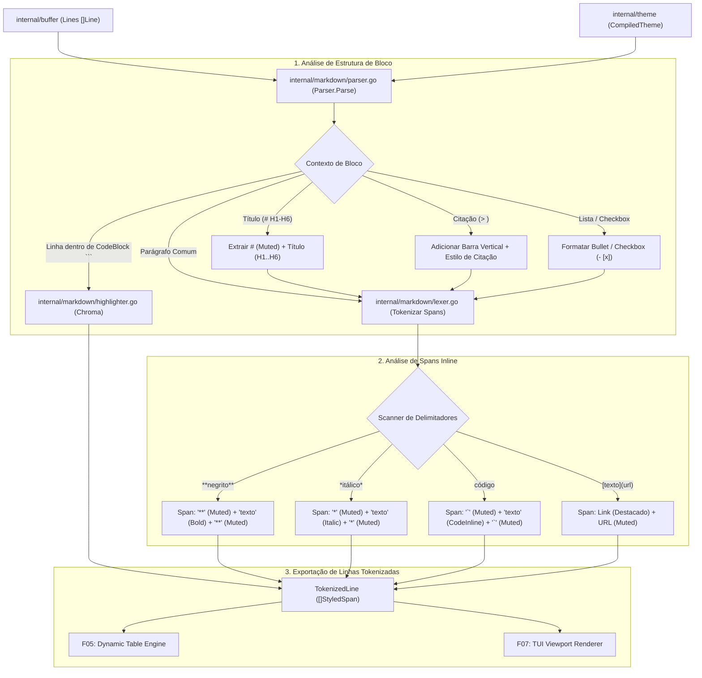

# Especificação Técnica: F04. Live Markdown Syntax Parser & Highlighting

## 1. Visão Geral Técnica

### O que será implementado
Implementação do motor de análise sintática e realce de Markdown em tempo real (`internal/markdown`), responsável por tokenizar e estilizar linhas de texto brutas do buffer (`internal/buffer`) utilizando as definições de tema compiladas (`internal/theme`). O motor detecta e aplica estilos hierárquicos em títulos (`#` H1 a `######` H6), atenua marcadores estruturais (`#`, `**`, `*`, `_`, `~~`, `` ` ``) com tom *dimmed/muted*, estiliza textos com ênfases (negrito, itálico, tachado, código inline), formata listas (`- `, `* `, `1. `, checkboxes `- [ ]`/`- [x]`), citações em bloco (`> `) com barra vertical decorativa, detecta links/URLs (`[texto](url)` e `https://...`) e aplica syntax highlighting multilíngue completo em blocos de código delimitados por crases triplas (```) via `github.com/alecthomas/chroma/v2`.

### Motivação Técnica
O principal objetivo do `md-notes` é proporcionar uma visualização rica sem esconder ou remover os caracteres Markdown originais. Para manter a produtividade extrema do desenvolvedor:
- O parsing e a tokenização devem ser executados incrementalmente em menos de 1 milissegundo por linha para sustentar taxas constantes de 60 FPS durante a digitação e navegação rápida no terminal.
- A integridade textual deve ser 100% preservada: marcadores sintáticos (`#`, `**`, etc.) continuam visíveis na tela em tom atenuado, permitindo que o usuário edite a estrutura diretamente sem alternar entre "modo preview" e "modo código".
- O motor deve fornecer uma estrutura de dados uniforme de linhas tokenizadas (`TokenizedLine` e `StyledSpan`) para consumo direto pelo Dynamic Table Engine (F05) e pelo Viewport Renderer (F07).

### Escopo

**Incluído (Core + Full Scope):**
- Lexer linear de passagem única orientado a linhas e blocos multiline.
- Destaque hierárquico de títulos Markdown (`#` H1 a `######` H6) com cores do tema e peso negrito, mantendo os caracteres `#` atenuados (`theme.Muted`).
- Formatação inline de estilos com preservação de marcadores atenuados:
  - `**negrito**` (marcadores `**` em muted, texto em `theme.Bold`).
  - `*itálico*` e `_itálico_` (marcadores em muted, texto em `theme.Italic`).
  - `~~tachado~~` (marcadores em muted, texto em `theme.Strikethrough`).
  - `` `código inline` `` (marcadores em muted, texto em `theme.CodeInline`).
  - `[texto](url)` (delimitadores `[]()` e URL em muted, texto em destaque de link).
  - Suporte a formatações aninhadas (ex: `**texto em negrito com `código` e *itálico***`).
- Formatação de elementos de bloco:
  - Listas não ordenadas (`- `, `* `, `+ `) com marcadores estilizados.
  - Listas ordenadas (`1. `, `2. `) com numeração destacada.
  - Checkboxes (`- [ ]`, `- [x]`) com símbolos decorativos e marcadores legíveis.
  - Citações em bloco (`> `) com indicador vertical decorativo e texto em estilo de citação.
- Blocos de código delimitados por ```:
  - Identificação de linguagem (Go, Python, JS, TS, Rust, JSON, YAML, Bash, HTML, CSS, SQL, TOML, Markdown).
  - Syntax highlighting contextual de palavras-chave, literais, tipos e comentários via Chroma v2.
  - Aplicação de fundo visual contínuo (`theme.CodeBlock`) e recuo para linhas de código.
- Consumo direto de instâncias `lipgloss.Style` do `CompiledTheme` (F02) sem recompilações a cada frame.

**Excluído:**
- Alinhamento dinâmico de colunas e bordas de tabelas Markdown (delegado para F05).
- Destaque de termos correspondentes a buscas `/` (delegado para F06).
- Cálculo de quebra de linha visual (wrap) e rolagem de viewport (delegado para F07).

**Preocupações Transversais Integradas:**
- **Consumo do Buffer (F01):** Leitura de `[]Line` e runes UTF-8 sem modificar o buffer subjacente.
- **Consumo do Tema (F02):** Utilização dos estilos pré-compilados `H1` a `H6`, `Muted`, `Bold`, `Italic`, `CodeBlock`, `CodeInline`, etc.
- **Fornecimento de Linhas Tokenizadas:** Exportação de `[]TokenizedLine` para os estágios seguintes de renderização (F05 e F07).

---

## 2. Impacto na Arquitetura

### Componentes Afetados

| Componente / Arquivo | Tipo | Responsabilidade Principal |
|----------------------|------|---------------------------|
| `internal/markdown/token.go` | Novo | Definição de `TokenType`, `StyledSpan` e `TokenizedLine` |
| `internal/markdown/lexer.go` | Novo | Lexer linear para detecção de spans inline (`**`, `*`, `_`, `` ` ``, `~~`, links) |
| `internal/markdown/parser.go`| Novo | Analisador de blocos Markdown (Headings, CodeBlocks, Citações, Listas, Checkboxes) e gerenciador de contexto |
| `internal/markdown/highlighter.go`| Novo | Adaptador Chroma para syntax highlighting em blocos de código com cache de lexers |

### Diagrama de Arquitetura e Fluxo de Dados



---

## 3. Decisões Técnicas

| Decisão | Opção Escolhida | Alternativa Considerada | Trade-off / Justificativa |
|---|---|---|---|
| **Arquitetura do Parser** | Lexer/Parser linear direto em Go orientado a linhas e blocos | AST completa com biblioteca Goldmark / CommonMark | Parsers de AST completa reconstroem árvores sintáticas pesadas com muitas alocações a cada tecla digitada; o parser linear incremental processa apenas as linhas em exibição em < 1 ms sem GC overhead. |
| **Preservação de Marcadores** | Marcadores estruturais (`#`, `**`, `*`, `` ` ``) renderizados com estilo `theme.Muted` | Ocultar marcadores sintáticos e exibir apenas texto formatado | Ocultar marcadores em editores de texto dificulta a edição precisa de pontuações e causa pulos indesejados de cursor; atenuar com tom muted entrega clareza visual mantendo a previsibilidade posicional do cursor do Vim. |
| **Syntax Highlighting de Código** | `github.com/alecthomas/chroma/v2` com cache de lexers | Regex artesanal estática de palavras-chave | Chroma é a biblioteca padrão e madura no ecossistema Go para highlighting, suportando centenas de linguagens, tokens semânticos detalhados e compatibilidade Truecolor. |
| **Gerenciamento de Estado de Bloco** | `BlockContext` mantido de forma linear pelo parser do documento | Parsing totalmente sem estado por linha isolada | Permite identificar blocos de código com crases triplas (```) que se estendem por dezenas de linhas sem perder a linguagem selecionada. |
| **Formatações Aninhadas** | Pilha de estilos aplicados cumulativamente por segmento de texto | Apenas uma formatação por span | Permite renderizar corretamente construções como `**texto em negrito com `código` e *itálico***`. |

---

## 4. Visão Geral de Componentes

### Módulos e Arquivos

#### 1. `internal/markdown/token.go`
- **Novo/Modificado:** Novo
- **Propósito:** Definição das estruturas de tokens, spans estilizados e linhas tokenizadas.
- **Responsabilidades:**
  - Enum `TokenType`: `TokenText`, `TokenHeading`, `TokenMarker`, `TokenBold`, `TokenItalic`, `TokenCodeInline`, `TokenCodeBlock`, `TokenQuote`, `TokenList`, `TokenCheckbox`, `TokenLink`.
  - Struct `StyledSpan`: `Text string`, `Style lipgloss.Style`, `Type TokenType`.
  - Struct `TokenizedLine`: `Spans []StyledSpan`, `Original buffer.Line`, `IsCodeBlock bool`, `IsHeading bool`.
  - Método `(tl TokenizedLine) Render() string`: Concatena os spans aplicando estilos Lipgloss.

#### 2. `internal/markdown/lexer.go`
- **Novo/Modificado:** Novo
- **Propósito:** Scanner de texto inline para identificar delimitadores e spans de ênfase.
- **Responsabilidades:**
  - Tokenizar `**`, `*`, `_`, `~~`, `` ` ``, `[texto](url)`, `https://...`.
  - Gerar spans de marcadores com `theme.Muted` e spans internos com o estilo correspondente (`Bold`, `Italic`, `CodeInline`).
  - Processar aninhamentos de estilos.

#### 3. `internal/markdown/parser.go`
- **Novo/Modificado:** Novo
- **Propósito:** Analisador estrutural de blocos Markdown e orquestrador de parsing.
- **Responsabilidades:**
  - Processar títulos (`# ` a `###### `) aplicando cores H1..H6 e negrito.
  - Processar citações em bloco (`> `) com barra vertical.
  - Processar listas (`- `, `* `, `1. `) e checkboxes (`- [ ]`, `- [x]`).
  - Manter o `BlockContext` para blocos de código multiline iniciados por ```.

#### 4. `internal/markdown/highlighter.go`
- **Novo/Modificado:** Novo
- **Propósito:** Adaptador do Chroma v2 para coloração de sintaxe em blocos de código.
- **Responsabilidades:**
  - Mapear nomes de linguagem (ex: `go`, `python`, `js`, `rust`, `json`, `yaml`, `bash`).
  - Formatar tokens Chroma em `StyledSpan` com cores Truecolor.
  - Fornecer fallback rápido caso a linguagem não seja informada ou não seja suportada.

---

## 5. Contratos de Interface & API

*N/A - Aplicação CLI/TUI nativa sem exposição de endpoints de rede HTTP ou RPC.*

### Contratos Internos entre Pacotes (Go Signatures)

```go
package markdown

import (
    "github.com/charmbracelet/lipgloss"
    "md-notes/internal/buffer"
    "md-notes/internal/theme"
)

type TokenType int

const (
    TokenText TokenType = iota
    TokenMarker
    TokenHeading
    TokenBold
    TokenItalic
    TokenStrike
    TokenCodeInline
    TokenCodeBlock
    TokenQuote
    TokenList
    TokenCheckbox
    TokenLink
)

type StyledSpan struct {
    Text  string
    Style lipgloss.Style
    Type  TokenType
}

type TokenizedLine struct {
    Spans       []StyledSpan
    Original    buffer.Line
    IsCodeBlock bool
    IsHeading   bool
    HeadingLvl  int
}

func (tl TokenizedLine) Render() string
func (tl TokenizedLine) PlainText() string

type Parser struct {
    theme       *theme.CompiledTheme
    highlighter *Highlighter
}

func NewParser(th *theme.CompiledTheme) *Parser
func (p *Parser) SetTheme(th *theme.CompiledTheme)
func (p *Parser) ParseLine(line buffer.Line, inCodeBlock *bool, codeLang *string) TokenizedLine
func (p *Parser) ParseBuffer(lines []buffer.Line) []TokenizedLine
```

---

## 6. Modelo de Dados em Memória

### Estruturas de Dados do Parser Markdown

```go
// Representa um trecho estilizado com texto e estilo Lipgloss
type StyledSpan struct {
    Text  string
    Style lipgloss.Style
    Type  TokenType
}

// Linha completa de Markdown tokenizada em múltiplos spans
type TokenizedLine struct {
    Spans       []StyledSpan
    Original    buffer.Line
    IsCodeBlock bool
    IsHeading   bool
    HeadingLvl  int
}

// Contexto do bloco de código durante o parsing contínuo
type CodeBlockContext struct {
    InCodeBlock bool
    Language    string
}
```

---

## 7. Estratégia de Testes

### Estrutura de Arquivos de Teste

| Arquivo de Teste | Tipo | Alvo | Meta de Cobertura |
|------------------|------|------|-------------------|
| `internal/markdown/lexer_test.go` | Unitário | Spans inline (`**`, `*`, `_`, `` ` ``, `~~`, links) e aninhamentos | 95% |
| `internal/markdown/parser_test.go`| Unitário | Headings H1-H6, citações, listas, checkboxes e contexto multiline | 95% |
| `internal/markdown/highlighter_test.go`| Unitário | Chroma highlighting para Go, Python, JSON, YAML e fallback | 90% |
| `internal/markdown/integration_test.go`| Integração | Parsing de buffer completo, integração com tema e latência < 1ms | 95% |

### Mapeamento de Funções de Teste

#### `internal/markdown/lexer_test.go`
- `TestLexer_BoldAndItalic`: Valida `**negrito**` e `*itálico*` com marcadores em `Muted` e texto interno enriquecido.
- `TestLexer_InlineCode`: Valida `` `código inline` `` com fundo e cor de destaque.
- `TestLexer_Strikethrough`: Valida `~~tachado~~`.
- `TestLexer_LinksAndURLs`: Valida `[texto](https://url)` e links autônomos.
- `TestLexer_NestedStyles`: Valida combinações como `**negrito com *itálico* e `código`**`.

#### `internal/markdown/parser_test.go`
- `TestParser_HeadingsHierarchy`: Valida `#` H1 a `######` H6 com cores distintas e peso negrito.
- `TestParser_Blockquotes`: Valida `> citação` com barra decorativa e recuo.
- `TestParser_ListsAndCheckboxes`: Valida `- item`, `1. item`, `- [ ] pendente`, `- [x] concluído`.
- `TestParser_CodeBlockContext`: Valida abertura de ````go ... ```` e fechamento com ```` mantendo o contexto de linhas intermediárias.

#### `internal/markdown/highlighter_test.go`
- `TestHighlighter_GoCode`: Valida realce de `package`, `func`, `struct` em código Go.
- `TestHighlighter_PythonAndJSON`: Valida realce de JSON (`{"key": "value"}`) e Python (`def foo():`).
- `TestHighlighter_FallbackUnrecognizedLang`: Valida fallback gracioso para código sem linguagem especificada.

#### `internal/markdown/integration_test.go`
- `TestMarkdown_FullDocumentParsing`: Faz o parse de documento completo de 500 linhas com todos os elementos Markdown e valida integridade.
- `TestMarkdown_ParsingPerformance`: Mede o tempo de parsing de 1.000 linhas, assegurando latência inferior a 1 ms por linha.
