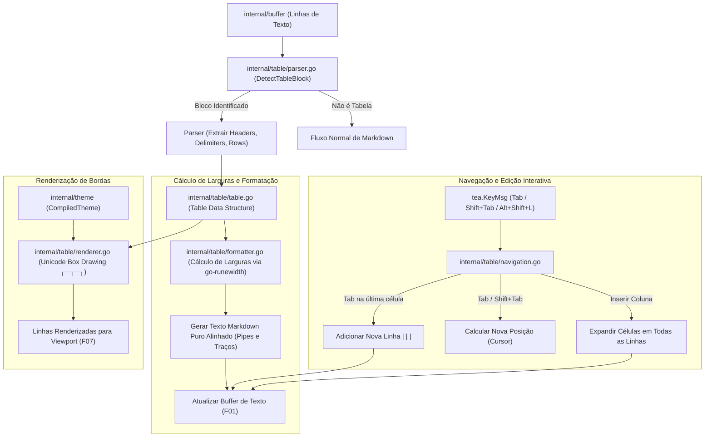

# Especificação Técnica: F05. Dynamic Markdown Table Engine

## 1. Visão Geral Técnica

### O que será implementado
Implementação do motor dinâmico de tabelas Markdown (`internal/table`), responsável por detectar blocos de tabela no padrão GitHub Flavored Markdown (GFM), calcular larguras máximas de coluna com precisão de caracteres Unicode/emojis (via `mattn/go-runewidth`), aplicar diretivas de alinhamento (`:---`, `:---:`, `---:`), formatar o buffer de texto com espaçamentos alinhados, renderizar bordas estéticas Unicode de desenho de caixa (`┌`, `┬`, `┐`, `├`, `┼`, `┤`, `└`, `┴`, `┘`, `│`, `─`) ou ASCII, e fornecer navegação fluida entre células via `Tab` / `Shift+Tab` com criação automática de novas linhas ao final da tabela e atalhos de manipulação de colunas (`Alt+Shift+L` e `Alt+Shift+H`).

### Motivação Técnica
Tabelas Markdown brutas frequentemente sofrem com desalinhamento visual quando o texto de uma célula é editado, quebrando a legibilidade durante a escrita. Para solucionar essa deficiência:
- As colunas devem recalcular suas larguras em tempo real durante a digitação no modo Insert sem travamentos ou degradação da taxa de 60 FPS.
- O cálculo de largura de caracteres deve computar corretamente caracteres de largura dupla (emojis como 🚀, caracteres CJK e símbolos especiais), impedindo que as bordas da tabela fiquem tortas no terminal.
- O arquivo gravado em disco deve manter estritamente a sintaxe Markdown pura com pipes `|` e hífens `-`, garantindo compatibilidade total com repositórios Git, Obsidian e renderizadores padrão.
- A experiência de navegação por teclado (`Tab`, `Shift+Tab`) deve assemelhar-se à de uma planilha ágil de terminal.

### Escopo

**Incluído (Core + Full Scope):**
- Detecção automática de blocos contíguos de tabela Markdown (linhas iniciadas ou divididas por `|` acompanhadas por linha separadora com hífens `|---|---|`).
- Parser estrutural de tabela: extração de cabeçalho (`HeaderRow`), separador com alinhamentos (`DelimiterRow`), e linhas de dados (`DataRows`).
- Suporte completo às diretivas de alinhamento GFM:
  - `:---` ou `---` (alinhamento à esquerda - `AlignLeft`).
  - `:---:` (alinhamento centralizado - `AlignCenter`).
  - `---:` (alinhamento à direita - `AlignRight`).
- Cálculo preciso de largura visual de colunas utilizando `mattn/go-runewidth` para runes UTF-8 e emojis.
- Formatação e auto-alinhamento de Markdown puro: reformatar as linhas brutas da tabela no buffer com espaços de padding proporcionais.
- Renderização visual rica de bordas: geração de representação em caixa Unicode (`┌─┬─┐`, `│ │ │`, `├─┼─┤`, `└─┴─┘`) ou ASCII de acordo com a configuração ativa (`editor.table_borders`).
- Navegação interativa por células:
  - `Tab`: avança para a próxima célula à direita (reformatando a linha atual); ao final da última linha, adiciona uma nova linha vazia `|  |  |` e posiciona o cursor na primeira célula.
  - `Shift+Tab`: retrocede para a célula anterior à esquerda.
- Manipulação de colunas (Full Scope):
  - Inserção de nova coluna à direita (`Alt+Shift+L`) ou à esquerda (`Alt+Shift+H`).
  - Deleção da coluna sob o cursor (`Alt+Shift+X`).
- Realce de sintaxe inline dentro das células de tabela (negrito, itálico, código inline) integrado com o parser Markdown (F04).

**Excluído:**
- Fórmulas matemáticas ou cálculos estilo planilha eletrônica.
- Mesclagem de células (*rowspan* / *colspan* - não suportado na especificação GFM).

**Preocupações Transversais Integradas:**
- **Consumo do Buffer (F01):** Mutação das linhas de tabela e inserção de novas linhas de forma atômica no buffer.
- **Integração com o Vim Engine (F03):** Captura de `Tab` e `Shift+Tab` em modo Insert/Normal e mapeamento de coordenadas de cursor.
- **Fornecimento para o Viewport (F07):** Exportação de representação estilizada com estilos Lipgloss para exibição fluida.

---

## 2. Impacto na Arquitetura

### Componentes Afetados

| Componente / Arquivo | Tipo | Responsabilidade Principal |
|----------------------|------|---------------------------|
| `internal/table/table.go` | Novo | Estruturas de dados `Table`, `Row`, `Cell`, enum `Alignment` e modelo em memória |
| `internal/table/parser.go` | Novo | Detecção de blocos de tabela, parsing de linhas com pipes e extração de alinhamentos |
| `internal/table/formatter.go` | Novo | Cálculo de larguras máximas com `go-runewidth`, aplicação de padding e formatação GFM limpa |
| `internal/table/renderer.go` | Novo | Renderização com bordas estéticas Unicode de desenho de caixa e estilos Lipgloss |
| `internal/table/navigation.go`| Novo | Lógica de salto entre células com `Tab`/`Shift+Tab`, auto-criação de linhas e manipulação de colunas |

### Diagrama de Arquitetura e Fluxo de Dados



---

## 3. Decisões Técnicas

| Decisão | Opção Escolhida | Alternativa Considerada | Trade-off / Justificativa |
|---|---|---|---|
| **Formato Armazenado no Buffer** | Markdown padrão GFM com pipes `|` e hífens `-` alinhados | Armazenar caracteres Unicode de caixa diretamente no buffer | Armazenar Markdown GFM garante portabilidade absoluta dos arquivos gerados, permitindo visualização idêntica no GitHub, Obsidian e ferramentas externas. |
| **Cálculo de Largura de Coluna** | `github.com/mattn/go-runewidth` | Contagem de runes `len([]rune(str))` | `len([]rune)` falha em emojis (🚀 = 2 colunas), kanjis/CJK e acentos compostos, causando desalinhamento visual das colunas no terminal; `go-runewidth` calcula a largura exata de células de terminal. |
| **Navegação com Tab** | Interceptar `Tab` no modo Insert apenas quando o cursor estiver dentro de um bloco de tabela válido | `Tab` sempre insere espaços em branco mesmo em tabelas | Proporciona experiência moderna e ágil similar a editores como Typora e Obsidian, eliminando a digitação manual repetitiva de pipes e espaços. |
| **Renderização de Bordas** | Alternância configurável entre bordas estéticas Unicode (`┌─┬─┐`) e ASCII padrão | Sempre forçar desenho de caixa Unicode | Permite que usuários com fontes ou terminais legados sem suporte completo a caracteres de caixa utilizem a exibição ASCII clássica sem quebras visuais. |

---

## 4. Visão Geral de Componentes

### Módulos e Arquivos

#### 1. `internal/table/table.go`
- **Novo/Modificado:** Novo
- **Propósito:** Estruturas de dados fundamentais do motor de tabelas.
- **Responsabilidades:**
  - Enum `Alignment`: `AlignLeft`, `AlignCenter`, `AlignRight`.
  - Struct `Cell`: `Text string`, `Width int`, `RawText string`.
  - Struct `Row`: `Cells []Cell`, `IsHeader bool`, `IsDelimiter bool`.
  - Struct `Table`: `StartLine int`, `EndLine int`, `Alignments []Alignment`, `Header Row`, `Rows []Row`, `ColWidths []int`.

#### 2. `internal/table/parser.go`
- **Novo/Modificado:** Novo
- **Propósito:** Detector e extrator de blocos de tabela a partir de linhas brutas.
- **Responsabilidades:**
  - `IsTableLine(line string) bool`: Identifica se a linha contém pipes estruturais.
  - `IsDelimiterLine(line string) ([]Alignment, bool)`: Analisa se a linha é um separador de cabeçalho (`|:---|:---:|---:|`).
  - `ParseTable(lines []string, startIdx int) (*Table, int, error)`: Constrói o modelo `Table` e retorna a linha final do bloco.

#### 3. `internal/table/formatter.go`
- **Novo/Modificado:** Novo
- **Propósito:** Cálculo de larguras máximas e formatação do texto puro.
- **Responsabilidades:**
  - `CalculateColumnWidths(t *Table) []int`: Calcula a largura máxima de cada coluna usando `go-runewidth`.
  - `FormatMarkdownTable(t *Table) []string`: Retorna as linhas em Markdown GFM com espaçamento e padding perfeitamente alinhados.

#### 4. `internal/table/renderer.go`
- **Novo/Modificado:** Novo
- **Propósito:** Renderização de bordas de desenho de caixa Unicode e estilos de tema.
- **Responsabilidades:**
  - Gerar bordas superior (`┌─┬─┐`), divisória (`├─┼─┤`) e inferior (`└─┴─┘`).
  - Aplicar estilos Lipgloss de cabeçalho (`theme.TableHead`) e bordas (`theme.TableBorder`).

#### 5. `internal/table/navigation.go`
- **Novo/Modificado:** Novo
- **Propósito:** Lógica de navegação de células e comandos de mutação de tabela.
- **Responsabilidades:**
  - `NextCell(t *Table, curRow, curCol int) (nextRow, nextCol int, isNewRow bool)`: Calcula a próxima célula para a tecla `Tab`.
  - `PrevCell(t *Table, curRow, curCol int) (prevRow, prevCol int)`: Calcula a célula anterior para `Shift+Tab`.
  - `InsertColumn(t *Table, colIdx int, atRight bool)`: Insere uma nova coluna em todas as linhas.
  - `DeleteColumn(t *Table, colIdx int)`: Remove uma coluna da tabela.

---

## 5. Contratos de Interface & API

*N/A - Aplicação CLI/TUI nativa sem exposição de endpoints de rede HTTP ou RPC.*

### Contratos Internos entre Pacotes (Go Signatures)

```go
package table

import (
    "github.com/charmbracelet/lipgloss"
    "md-notes/internal/theme"
)

type Alignment int

const (
    AlignLeft Alignment = iota
    AlignCenter
    AlignRight
)

type Cell struct {
    Text  string
    Width int
}

type Row struct {
    Cells       []Cell
    IsHeader    bool
    IsDelimiter bool
}

type Table struct {
    StartLine  int
    EndLine    int
    Alignments []Alignment
    Header     Row
    Rows       []Row
    ColWidths  []int
}

func DetectTable(lines []string, cursorLine int) (*Table, bool)
func (t *Table) FormatGFM() []string
func (t *Table) RenderUnicode(th *theme.CompiledTheme) []string
func (t *Table) InsertRow(afterRowIdx int)
func (t *Table) InsertColumn(colIdx int, atRight bool)
func (t *Table) DeleteColumn(colIdx int)
```

---

## 6. Modelo de Dados em Memória

### Estruturas de Dados do Table Engine

```go
// Representa uma célula individual da tabela
type Cell struct {
    Text  string // Texto limpo da célula (sem espaços de padding externos)
    Width int    // Largura visual calculada via runewidth.StringWidth
}

// Representa uma linha de tabela contendo múltiplas células
type Row struct {
    Cells       []Cell
    IsHeader    bool
    IsDelimiter bool
}

// Representa a tabela completa e seus metadados de alinhamento
type Table struct {
    StartLine  int
    EndLine    int
    Alignments []Alignment
    Header     Row
    Rows       []Row
    ColWidths  []int
}
```

---

## 7. Estratégia de Testes

### Estrutura de Arquivos de Teste

| Arquivo de Teste | Tipo | Alvo | Meta de Cobertura |
|------------------|------|------|-------------------|
| `internal/table/parser_test.go` | Unitário | Detecção de tabelas, delimitadores e alinhamentos `:---`, `:---:`, `---:` | 95% |
| `internal/table/formatter_test.go`| Unitário | Cálculo de larguras com runes e emojis, padding e formatação GFM | 95% |
| `internal/table/renderer_test.go` | Unitário | Desenho de caixa Unicode (`┌─┬─┐`), estilos de tema e fallback ASCII | 90% |
| `internal/table/navigation_test.go`| Unitário / Integração | Navegação `Tab`, `Shift+Tab`, auto-criação de linhas e inserção/deleção de colunas | 95% |
| `internal/table/integration_test.go`| Integração | Mutação do buffer de texto, preservação de cursor e integração com temas | 90% |

### Mapeamento de Funções de Teste

#### `internal/table/parser_test.go`
- `TestParser_DetectValidTable`: Valida identificação de tabela Markdown com cabeçalho e separador.
- `TestParser_AlignmentsExtraction`: Testa extração de `:---` (Left), `:---:` (Center) e `---:` (Right).
- `TestParser_IgnoreNonTablePipes`: Valida que linhas com pipe isolado fora do formato de tabela não são interpretadas incorretamente.

#### `internal/table/formatter_test.go`
- `TestFormatter_StandardWidthCalculation`: Valida cálculo de largura máxima de colunas com texto ASCII.
- `TestFormatter_UnicodeAndEmojiWidth`: Testa cálculo de largura com emojis (`🚀`, `✨`) e acentos usando `go-runewidth`.
- `TestFormatter_FormatGFMOutput`: Valida geração de Markdown puro com padding uniforme.

#### `internal/table/renderer_test.go`
- `TestRenderer_UnicodeBoxBorders`: Valida geração das bordas `┌`, `┬`, `┐`, `├`, `┼`, `┤`, `└`, `┴`, `┘`.
- `TestRenderer_AsciiFallback`: Valida renderização com pipes simples `|` e `-` quando configurado em modo ASCII.

#### `internal/table/navigation_test.go`
- `TestNavigation_TabNextCell`: Valida salto para a próxima célula à direita ao pressionar `Tab`.
- `TestNavigation_ShiftTabPrevCell`: Valida retorno para a célula anterior ao pressionar `Shift+Tab`.
- `TestNavigation_TabAutoCreateRow`: Valida que pressionar `Tab` na última célula cria automaticamente nova linha `|  |  |`.
- `TestNavigation_InsertAndDeleteColumn`: Valida inserção de coluna (`Alt+Shift+L`) e remoção (`Alt+Shift+X`).
