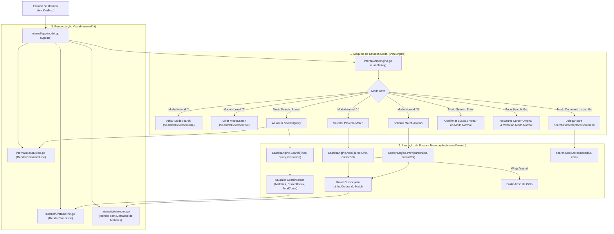

# Especificação Técnica: F06. Interactive Search & Replace System

## 1. Visão Geral Técnica

### O que será implementado
Implementação e integração completa do sistema interativo de busca e substituição (`internal/search`, `internal/vim`, `internal/ui` e `internal/app`). O sistema é responsável por:
1. Iniciar o modo de busca a partir do modo Normal ao pressionar `/` (busca direta para frente) ou `?` (busca reversa para trás), exibindo o prompt correspondente na barra inferior.
2. Executar buscas incrementais em tempo real conforme a digitação do usuário, calculando e sobrepondo o destaque de todas as correspondências visíveis no viewport (`theme.SearchMatch`) e destacando a ocorrência sob o cursor (`theme.SearchMatchCurrent`).
3. Confirmar a busca com `Enter`, posicionando o cursor na ocorrência ativa e retornando ao modo Normal com o padrão ativo retido em memória.
4. Cancelar a busca com `Esc`, restaurando a posição original do cursor e o modo Normal sem alterar o buffer.
5. Navegar ciclicamente entre ocorrências no modo Normal com `n` (próximo match no sentido da busca) e `N` (match anterior no sentido inverso), com notificação de *wrap-around* ao atingir os limites do documento (`"Busca atingiu o fim do arquivo, continuando do início"`).
6. Exibir a contagem de correspondências ativas e totais na barra de status (ex: `[2/15]`) ou mensagem de erro padrão quando não houver correspondências (`E486: Padrão não encontrado: <termo>`).
7. Suportar *smart-case* (insensível se todo em minúsculas; sensível se contiver ao menos uma maiúscula) e fallback transparente de regex para busca literal durante digitação de sintaxe incompleta.
8. Executar comandos ex de substituição atômica (`:s/antigo/novo/g`, `:%s/antigo/novo/g`) e confirmação passo a passo (`:%s/antigo/novo/gc` com `y/n/a/q`), agrupando todas as alterações em um único snapshot de histórico de Undo/Redo (F03).

### Motivação Técnica
Em editores baseados em terminal, a busca rápida (`/`) é o mecanismo primário de navegação de longa distância. O `md-notes` já possuía os algoritmos de busca isolados no pacote `internal/search`, porém faltava a ponte arquitetural com a máquina de estados modal (`internal/vim`), com a renderização da linha de comando inferior (`internal/ui`) e com o despachante de eventos reativo do Bubble Tea (`internal/app`). A integração direta desses módulos restaura a ergonomia universal do padrão Vim e viabiliza a busca incremental a 60 FPS com latência inferior a 5 ms.

### Escopo

**Incluído (Core + Full Scope):**
- **Modo de Busca no Vim Engine (`internal/vim`):**
  - Adição do modo `ModeSearch` ao enum `vim.Mode`.
  - Captura das teclas `/` e `?` no modo Normal para transicionar para `ModeSearch`, inicializando o buffer de query e sentido de busca.
  - Processamento de digitação de caracteres, Backspace (com saída limpa se vazio), confirmação (`Enter`) e cancelamento (`Esc`).
  - Mapeamento das teclas `n` e `N` no modo Normal para saltos direcionais entre matches.
  - Reconhecimento e roteamento de comandos ex `:s` e `:%s` em `internal/vim/command.go`.
- **Motor de Busca e Padrões (`internal/search`):**
  - Compilador de padrões com suporte a *smart-case*, expressões regulares Go (`regexp.Compile`) e fallback literal.
  - Varredura em tempo real sobre coordenadas de runes UTF-8 em `internal/buffer`.
  - Navegação direcional `Next(curLine, curCol)` e `Prev(curLine, curCol)` com flag de wrap-around.
  - Máquina de estados para substituição interativa `gc` (`y/n/a/q`).
- **Renderização da Linha de Prompt (`internal/ui`):**
  - Exibição de `/query` ou `?query` com cursor de edição na linha de comando inferior em `RenderCommandLine`.
  - Exibição do contador `[x/y]` ou mensagens de erro `E486` / avisos de wrap-around.
- **Coordenação no Ciclo de Vida Bubble Tea (`internal/app`):**
  - Disparo de busca incremental a cada caractere inserido ou apagado durante `ModeSearch`.
  - Posicionamento do cursor na ocorrência encontrada e rolagem suave do viewport via `AdjustScroll`.
  - Retorno ao modo Normal ao confirmar com `Enter` mantendo os destaques na tela.
  - Limpeza dos destaques e mensagens ao executar novas ações de edição ou comandos de escape.

**Excluído:**
- Busca em múltiplos arquivos ou fuzzy file finder (delegado para ferramentas externas como ripgrep/fzf).
- Expressões regulares incompatíveis com o dialeto Go (sem lookahead ou lookbehind arbitrário).

---

## 2. Impacto na Arquitetura

### Componentes Afetados

| Componente / Arquivo | Tipo | Responsabilidade Principal |
|----------------------|------|---------------------------|
| `internal/vim/state.go` | Modificado | Adicionar `ModeSearch` em `Mode`, campos `SearchQuery`, `SearchIsReverse`, `SearchInitPos` em `ModalState` |
| `internal/vim/engine.go` | Modificado | Interceptar `/`, `?`, `n`, `N` em modo Normal; despachar digitação em `ModeSearch` |
| `internal/vim/command.go` | Modificado | Reconhecer sintaxe `:s/.../.../` e `:%s/.../.../`, invocando o parser de substituição |
| `internal/ui/statusline.go` | Modificado | Renderizar o prompt `/` ou `?` com a query na linha inferior quando em `ModeSearch` |
| `internal/app/model.go` | Modificado | Conectar eventos de `HandleKey` ao `SearchEngine.Search`, atualizar cursor, scroll e status line |
| `internal/search/engine.go` | Existente | Motor de varredura e navegação de ocorrências |
| `internal/search/pattern.go` | Existente | Compilação com smart-case e fallback para busca literal |
| `internal/search/match.go` | Existente | Estruturas `Match` e `SearchResult` |
| `internal/search/replace.go` | Existente | Parser e executor de substituições `:s` e `:%s` |

### Diagrama de Arquitetura e Fluxo de Dados



---

## 3. Decisões Técnicas

| Decisão | Opção Escolhida | Alternativa Considerada | Trade-off / Justificativa |
|---|---|---|---|
| **Definição de `ModeSearch` no Vim Engine** | Tratar `ModeSearch` como um modo de primeira classe no enum `vim.Mode` | Manter em `ModeCommand` com prefixo especial | Garantir isolamento conceitual e clareza de estado: a busca tem comportamento incremental com rollback via `Esc`, enquanto `ModeCommand` aguarda `Enter` para execução de comandos ex. |
| **Busca Incremental no Loop de Update** | Disparar `SearchEngine.Search` a cada caractere digitado diretamente no handler do Bubble Tea | Aguardar `Enter` antes de varrer o buffer | O feedback em tempo real é exigência explícita do PRD (F06) e padrão em editores modernos; como a varredura linear do `SearchEngine` consome < 1 ms em notas comuns, o impacto em CPU é desprezível. |
| **Restauração do Cursor ao Cancelar com `Esc`** | Armazenar a posição inicial do cursor (`SearchInitPos`) ao digitar `/` e restaurá-la caso o usuário pressione `Esc` | Manter o cursor na última ocorrência transitória | Fidelidade total ao comportamento do Vim: pressionar `Esc` durante a busca deve abortar a navegação e retornar exatamente ao ponto de partida. |
| **Integração de Comandos Ex de Substituição** | Conectar `ExecuteExCommand` ao `search.ParseReplaceCommand` com snapshot de Undo | Criar outro analisador de comandos separado | Reutiliza a infraestrutura existente de `internal/vim/command.go` e assegura que `:s/antigo/novo/g` e `:%s/antigo/novo/g` sejam comandos ex válidos e integrados à pilha de histórico. |

---

## 4. Visão Geral de Componentes

### Módulos e Arquivos

#### 1. `internal/vim/state.go`
- **Novo/Modificado:** Modificado
- **Propósito:** Expandir o modelo de estado modal para acomodar busca.
- **Responsabilidades:**
  - Adicionar constante `ModeSearch` ao tipo `Mode`.
  - Atualizar `Mode.String()` para retornar `"SEARCH"`.
  - Expandir `ModalState` com:
    - `SearchQuery string`: texto digitado no prompt de busca.
    - `SearchIsReverse bool`: true para `?`, false para `/`.
    - `SearchInitPos Position`: posição do cursor antes do início da busca para rollback no `Esc`.

#### 2. `internal/vim/engine.go`
- **Novo/Modificado:** Modificado
- **Propósito:** Tratar teclas em modo Normal e modo Search.
- **Responsabilidades:**
  - No `handleNormalKey`:
    - Tecla `/`: entrar em `ModeSearch`, definir `SearchIsReverse = false`, salvar `SearchInitPos`.
    - Tecla `?`: entrar em `ModeSearch`, definir `SearchIsReverse = true`, salvar `SearchInitPos`.
    - Teclas `n` e `N`: retornar ação de navegação para o próximo/anterior match.
  - Implementar `handleSearchKey(msg tea.KeyMsg)`:
    - Runes: adicionar ao `SearchQuery`.
    - Backspace: remover último rune; se ficar vazio, retornar a `ModeNormal`.
    - `Esc`: cancelar busca, restaurar cursor para `SearchInitPos`, retornar a `ModeNormal`.
    - `Enter`: confirmar busca, retornar a `ModeNormal` mantendo query ativa para `n`/`N`.

#### 3. `internal/vim/command.go`
- **Novo/Modificado:** Modificado
- **Propósito:** Reconhecer e executar comandos de substituição na linha `:` .
- **Responsabilidades:**
  - Detectar se o comando inicia com `s/` ou `%s/`.
  - Invocar `search.ParseReplaceCommand` e executar substituição atômica no buffer.
  - Registrar snapshot na pilha de Undo (F03) e retornar mensagem de status (ex: `"3 substituições realizadas em 2 linhas"`).

#### 4. `internal/ui/statusline.go`
- **Novo/Modificado:** Modificado
- **Propósito:** Renderizar prompts de busca e indicadores de match.
- **Responsabilidades:**
  - Em `RenderCommandLine`: se `state.Mode == vim.ModeSearch`, exibir o prefixo `/` (ou `?`) seguido de `state.CommandInput`.
  - Em `RenderStatusLine`: exibir o bloco de contagem de matches `[x/y]` com cores temáticas.

#### 5. `internal/app/model.go`
- **Novo/Modificado:** Modificado
- **Propósito:** Orquestrador principal da busca interativa no Bubble Tea.
- **Responsabilidades:**
  - Conectar as alterações em `SearchQuery` ao `SearchEngine.Search`.
  - Quando em `ModeSearch`, posicionar o cursor no primeiro match encontrado em tempo real e rolar o viewport.
  - Tratar teclas `n` e `N`, invocando `SearchEngine.Next` ou `SearchEngine.Prev` e atualizando coordenadas do buffer.
  - Exibir avisos de wrap-around ou erro `E486: Padrão não encontrado`.

---

## 5. Contratos de Interface & API

### Extensões no Pacote `internal/vim`

```go
package vim

const (
    ModeNormal Mode = iota
    ModeInsert
    ModeVisualChar
    ModeVisualLine
    ModeVisualBlock
    ModeCommand
    ModeSearch // Novo modo para busca incremental '/' e '?'
)

type ModalState struct {
    CurrentMode     Mode
    Selection       *Selection
    CommandInput    string
    StatusMsg       string
    Count           int
    SearchQuery     string
    SearchIsReverse bool
    SearchInitPos   Position
}
```

---

## 6. Modelo de Dados em Memória

### Estrutura de Coordenação de Busca no Modelo Principal (`app.Model`)

```go
type Model struct {
    Buffer         *buffer.Buffer
    Vim            *vim.Engine
    Viewport       *ui.Viewport
    SearchEngine   *search.SearchEngine
    LastSearch     string // Última query confirmada para reutilização em 'n' e 'N'
    SearchActive   bool   // Indica se os destaques de busca devem ser exibidos no viewport
    StatusMsg      string
}
```

---

## 7. Estratégia de Testes

### Estrutura de Arquivos de Teste

| Arquivo de Teste | Tipo | Alvo | Meta de Cobertura |
|------------------|------|------|-------------------|
| `internal/vim/engine_test.go` | Unitário | Transição para `ModeSearch` com `/` e `?`, cancelamento com `Esc`, navegação `n`/`N` | 95% |
| `internal/vim/command_test.go` | Unitário | Parser de substituição `:s` e `:%s` integrado à linha de comando | 95% |
| `internal/ui/statusline_test.go` | Unitário | Renderização do prompt `/` e `?` na linha inferior | 95% |
| `internal/app/model_vim_test.go` | Integração | Fluxo completo de busca incremental no Bubble Tea, movimentação do cursor e wrap-around | 95% |
| `internal/search/*_test.go` | Existente | Testes de motor, regex, smart-case e replace | 95% |

### Mapeamento de Funções de Teste

#### `internal/vim/engine_test.go`
- `TestEngine_SearchModeTransitions`: Pressionar `/` entra em `ModeSearch`; digitar atualiza query; `Esc` restaura cursor inicial e retorna a `ModeNormal`.
- `TestEngine_SearchReverseMode`: Pressionar `?` ativa busca reversa.
- `TestEngine_SearchNavigationKeys`: Pressionar `n` e `N` em modo Normal invoca comandos de navegação.

#### `internal/ui/statusline_test.go`
- `TestCommandLine_RenderSearchPrompt`: Valida saída de `RenderCommandLine` com `/termo` e `?termo`.

#### `internal/app/model_vim_test.go`
- `TestModel_InteractiveSearchFlow`: Simula digitação de `/palavra`, valida atualização de matches e salto de cursor em tempo real.
- `TestModel_SearchNextPrevWrapAround`: Valida navegação sequencial e mensagem de wrap-around ao ultrapassar o fim do documento.
- `TestModel_SearchReplaceCommand`: Executa `:%s/antigo/novo/g` via interface do modelo e valida alteração do buffer e undo atômico com `u`.
