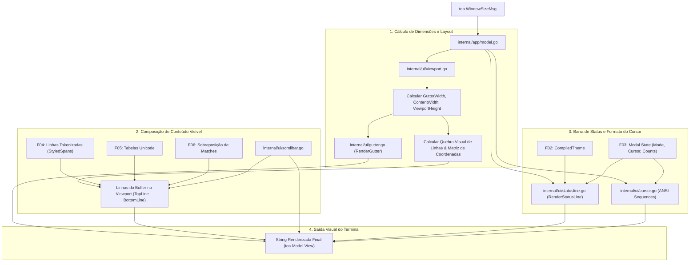

# Especificação Técnica: F07. TUI Viewport & Status Line Renderer

## 1. Visão Geral Técnica

### O que será implementado
Implementação da camada visual completa de renderização de interface no terminal (`internal/ui`), responsável por compor e desenhar o viewport verticalmente rolável a 60 FPS, gerenciar a coluna lateral de números de linha (*gutter*) com suporte a modos absoluto e relativo, aplicar quebra de linha suave (*soft-wrap*) sem alterar o buffer em disco, mapear coordenadas lógicas para coordenadas visuais de tela, desenhar a barra de rolagem minimalista (*scrollbar*), controlar os formatos nativos de cursor ANSI (`\x1b[2 q` para bloco, `\x1b[6 q` para barra vertical, `\x1b[4 q` para sublinhado), renderizar a barra de status inferior segmentada com Lipgloss (Modo com cor dinâmica, Nome do arquivo + indicador `[+]`, `Ln X, Col Y`, porcentagem de navegação `Top/Bot/%`, encoding `UTF-8`, quebra `LF/CRLF` e matches de busca `[x/y]`), e responder instantaneamente a eventos de redimensionamento do terminal (`tea.WindowSizeMsg`).

### Motivação Técnica
A interface de usuário do `md-notes` deve entregar a elegância visual e a fluidez de um editor moderno sem comprometer a performance e a simplicidade de terminal. Para alcançar essa excelência:
- A renderização deve processar estritamente as linhas visíveis na janela do terminal, mantendo o tempo de renderização de cada frame abaixo de 16 milissegundos (60 FPS contínuos) mesmo em notas extensas.
- O cursor posicionado pelo Vim Engine (F03) deve permanecer perfeitamente sincronizado na tela mesmo quando linhas longas sofrerem quebra visual (*soft-wrap*) em múltiplas linhas físicas no terminal.
- A barra de status inferior deve apresentar contraste visual sofisticado e divisão clara de blocos temáticos, fornecendo contexto situacional imediato ao usuário.
- O redimensionamento do terminal deve recalcular o layout sem artefatos visuais ou quebras de texto.

### Escopo

**Incluído (Core + Full Scope):**
- Viewport verticalmente rolável com cálculo de deslocamento (*scroll offset*) e margem de rolagem suave (*scrolloff*).
- Coluna lateral de números de linha (*gutter*):
  - Modo absoluto: numeração sequencial das linhas do arquivo (`1, 2, 3...`).
  - Modo relativo (`editor.relative_line_numbers = true`): linha atual com número absoluto e as demais com a distância relativa (`1, 2, 3...` para cima e para baixo).
  - Ajuste dinâmico da largura da coluna com base no número total de linhas do buffer (`len("9999") + 2`).
- Quebra de linha suave (*soft-wrap*):
  - Quebra visual inteligente de linhas longas que excedem a largura disponível sem inserir caracteres de nova linha no buffer original.
  - Matriz linear de mapeamento bidirecional de coordenadas (`LogicalPos { Line, Col }` <-> `VisualPos { ScreenY, ScreenX }`).
- Barra de rolagem visual (*scrollbar*):
  - Indicador minimalista na margem direita da janela proporcional à altura do documento e à posição atual de rolagem.
- Formatos de cursor ANSI nativos:
  - Bloco sólido (`\x1b[2 q`) no modo Normal.
  - Barra vertical fina (`\x1b[6 q`) no modo Insert.
  - Sublinhado (`\x1b[4 q`) nos modos Visuais (`v`, `V`, `Ctrl+v`).
  - Restauração do cursor padrão do terminal na finalização do editor.
- Barra de status inferior elegante com segmentos Lipgloss:
  - Segmento de Modo: fundo colorido e texto em negrito (` NORMAL `, ` INSERT `, ` VISUAL `, ` COMMAND `) variando conforme o tema ativo.
  - Segmento de Arquivo: nome do arquivo e indicador de modificação `[+]` caso o buffer esteja dirty.
  - Segmento de Posição: coordenadas do cursor (`Ln X, Col Y`).
  - Segmento de Progresso: percentual no arquivo (`Top`, `54%`, `Bot`).
  - Segmento de Encoding e Formato: `UTF-8 | LF` ou `UTF-8 | CRLF`.
  - Segmento de Busca: contagem de ocorrências ativas quando a busca estiver habilitada (ex: `[3/15]`).
  - Linha de comando ou mensagens de status/erro (`E37`, `E492`) no rodapé inferior.
- Redimensionamento dinâmico de terminal (`tea.WindowSizeMsg`):
  - Recálculo imediato de `WindowWidth` e `WindowHeight`, adaptando o viewport e a barra de status sem travamentos.

**Excluído:**
- Suporte a múltiplas janelas divididas lado a lado (*split windows* - reservado para evoluções futuras).
- Renderização de gráficos ou imagens no terminal via protocolo Kitty/Sixel.

**Preocupações Transversais Integradas:**
- **Consumo do Buffer (F01):** Leitura de `[]Line`, `Cursor`, `IsDirty`, `FilePath` e dimensões.
- **Consumo do Tema e Configurações (F02):** Aplicação de cores e estilos pré-compilados do `CompiledTheme` e respeito a `relative_line_numbers` e `table_borders`.
- **Consumo do Vim Engine (F03):** Obtenção do modo ativo, seleções visuais e coordenadas do cursor.
- **Consumo de Markdown Spans (F04):** Renderização de `TokenizedLine` com cores e marcadores atenuados.
- **Consumo de Tabelas (F05):** Renderização de molduras de caixa Unicode alinhadas.
- **Consumo de Busca (F06):** Aplicação de sobreposições de cor nos matches e exibição da contagem na barra de status.

---

## 2. Impacto na Arquitetura

### Componentes Afetados

| Componente / Arquivo | Tipo | Responsabilidade Principal |
|----------------------|------|---------------------------|
| `internal/ui/viewport.go` | Novo | Orquestrador do viewport, cálculo de linhas visíveis, soft-wrap e matriz de coordenadas |
| `internal/ui/gutter.go` | Novo | Renderizador da coluna lateral de números de linha (absolutos e relativos) |
| `internal/ui/statusline.go` | Novo | Compositor da barra de status inferior com blocos estilizados via Lipgloss |
| `internal/ui/scrollbar.go` | Novo | Cálculo da posição e renderização da barra de rolagem minimalista |
| `internal/ui/cursor.go` | Novo | Controlador de sequências de escape ANSI para alternância de cursor |
| `internal/app/model.go` | Modificado | Integração do ciclo de renderização (`View`) e captura de `tea.WindowSizeMsg` |

### Diagrama de Arquitetura e Fluxo de Dados



---

## 3. Decisões Técnicas

| Decisão | Opção Escolhida | Alternativa Considerada | Trade-off / Justificativa |
|---|---|---|---|
| **Renderização Parcial de Linhas** | Processar e renderizar estritamente as linhas contidas na janela visível (`TopLine` até `TopLine + Height`) | Renderizar todo o buffer de 50.000 linhas a cada frame | Renderizar apenas as linhas visíveis garante tempo de renderização constante (< 5 ms) independentemente do tamanho do arquivo aberto, viabilizando 60 FPS contínuos. |
| **Mapeamento Bidirecional de Soft-Wrap** | Matriz de mapeamento linear calculada por frame associando índices lógicos do buffer às linhas visuais da tela | Deslocamento horizontal do viewport (*horizontal scrolling*) | Soft-wrap é essencial para leitura confortável de documentos Markdown em terminais estreitos, e a matriz de coordenadas assegura que o cursor do Vim permaneça no caractere exato da tela. |
| **Numeração Relativa de Linhas** | Cálculo dinâmico da distância com base no `Cursor.Line` (`|line - currentLine|`), mantendo o número absoluto na linha atual | Numeração relativa estática gravada em memória | Segue a convenção do Vim (`set number relativenumber`), facilitando a navegação com contadores numéricos (ex: `12k`, `5j`). |
| **Cursor ANSI Nativo** | Emissão de sequências de escape padrão VT100/Xterm (`\x1b[2 q`, `\x1b[6 q`, `\x1b[4 q`) | Desenho manual do caractere do cursor com Lipgloss invertido | O cursor nativo do terminal proporciona menor latência, pisca conforme as configurações do sistema operacional do usuário e não interfere no fluxo de caracteres da linha. |

---

## 4. Visão Geral de Componentes

### Módulos e Arquivos

#### 1. `internal/ui/viewport.go`
- **Novo/Modificado:** Novo
- **Propósito:** Gerenciador do viewport e cálculo de quebras visuais de linha.
- **Responsabilidades:**
  - `CalculateVisibleLines(buf *buffer.Buffer, width, height int, topRow int) ([]string, CoordMap)`: Processa as linhas a serem exibidas.
  - `AdjustScroll(cursor buffer.Cursor, scrolloff int)`: Atualiza `TopLine` garantindo margem de visibilidade.
  - Mapear coordenadas lógicas para coordenadas visuais de tela.

#### 2. `internal/ui/gutter.go`
- **Novo/Modificado:** Novo
- **Propósito:** Renderização da coluna de numeração de linhas.
- **Responsabilidades:**
  - `RenderGutterLine(lineIdx, cursorLine, totalLines int, relative bool, theme *theme.CompiledTheme) string`: Formata a célula do gutter com padding e estilo visual.

#### 3. `internal/ui/statusline.go`
- **Novo/Modificado:** Novo
- **Propósito:** Compositor visual da barra de status inferior.
- **Responsabilidades:**
  - `RenderStatusLine(state StatusState, theme *theme.CompiledTheme, width int) string`: Constrói a barra de status com blocos coloridos, alinhamento à esquerda e à direita e separadores.

#### 4. `internal/ui/scrollbar.go`
- **Novo/Modificado:** Novo
- **Propósito:** Renderizador da barra de rolagem lateral.
- **Responsabilidades:**
  - `RenderScrollbar(totalLines, visibleLines, topIndex, height int) []string`: Retorna os caracteres da barra de rolagem para cada linha do viewport.

#### 5. `internal/ui/cursor.go`
- **Novo/Modificado:** Novo
- **Propósito:** Controlador de formatos de cursor de terminal.
- **Responsabilidades:**
  - `GetCursorShapeSequence(mode vim.Mode) string`: Retorna a sequência ANSI correspondente (`\x1b[2 q`, `\x1b[6 q`, `\x1b[4 q`).

#### 6. `internal/app/model.go`
- **Novo/Modificado:** Modificado
- **Propósito:** Integrar os componentes de UI no ciclo de vida do Bubble Tea.
- **Responsabilidades:**
  - Tratar `tea.WindowSizeMsg` atualizando dimensões.
  - Gerar a saída completa em `View() string`.

---

## 5. Contratos de Interface & API

*N/A - Aplicação CLI/TUI nativa sem exposição de endpoints de rede HTTP ou RPC.*

### Contratos Internos entre Pacotes (Go Signatures)

```go
package ui

import (
    "md-notes/internal/buffer"
    "md-notes/internal/theme"
    "md-notes/internal/vim"
)

type Viewport struct {
    Width       int
    Height      int
    TopLine     int
    Scrolloff   int
    RelativeNum bool
    SoftWrap    bool
}

func NewViewport(w, h int) *Viewport
func (v *Viewport) SetDimensions(w, h int)
func (v *Viewport) Render(buf *buffer.Buffer, th *theme.CompiledTheme, cur vim.Position) string

type StatusState struct {
    Mode          vim.Mode
    FilePath      string
    IsDirty       bool
    CursorLine    int
    CursorCol     int
    TotalLines    int
    LineEnding    buffer.LineEnding
    SearchMatchCur int
    SearchMatchTot int
}

func RenderStatusLine(s StatusState, th *theme.CompiledTheme, width int) string
func GetCursorShapeSequence(mode vim.Mode) string
```

---

## 6. Modelo de Dados em Memória

### Estruturas de Dados do Viewport e Status Line

```go
// Estado completo consumido para renderização da barra de status
type StatusState struct {
    Mode           vim.Mode          // Modo ativo (NORMAL, INSERT, VISUAL, COMMAND)
    FilePath       string            // Caminho ou [Novo Arquivo] / [Scratchpad]
    IsDirty        bool              // true se houver alterações não salvas [+]
    CursorLine     int               // Linha atual do cursor (1-indexed)
    CursorCol      int               // Coluna atual do cursor (1-indexed)
    TotalLines     int               // Total de linhas no documento
    LineEnding     buffer.LineEnding // LF ou CRLF
    SearchMatchCur int               // Índice da ocorrência atual de busca (ou 0 se inativa)
    SearchMatchTot int               // Total de ocorrências encontradas
}

// Mapeamento de coordenadas entre buffer lógico e tela visual
type VisualCoordinate struct {
    ScreenY int // Linha relativa na tela (0 a ViewportHeight-1)
    ScreenX int // Coluna relativa na tela (0 a ViewportWidth-1)
}
```

---

## 7. Estratégia de Testes

### Estrutura de Arquivos de Teste

| Arquivo de Teste | Tipo | Alvo | Meta de Cobertura |
|------------------|------|------|-------------------|
| `internal/ui/gutter_test.go` | Unitário | Numeração absoluta, relativa, padding e destaque da linha ativa | 95% |
| `internal/ui/statusline_test.go`| Unitário | Formatação de segmentos Lipgloss, modos, dirty flag `[+]` e contagem de busca | 95% |
| `internal/ui/scrollbar_test.go` | Unitário | Cálculo de proporção e altura do thumb da barra de rolagem | 95% |
| `internal/ui/cursor_test.go` | Unitário | Sequências de escape ANSI para modos Normal, Insert e Visual | 95% |
| `internal/ui/viewport_test.go` | Integração | Soft-wrap, scrolloff, cálculo de linhas visíveis e coordenadas de tela | 90% |
| `internal/app/model_resize_test.go`| Integração | Tratamento de `tea.WindowSizeMsg` e renderização a 60 FPS | 90% |

### Mapeamento de Funções de Teste

#### `internal/ui/gutter_test.go`
- `TestGutter_AbsoluteNumbering`: Valida exibição sequencial `1, 2, 3...` com alinhamento à direita.
- `TestGutter_RelativeNumbering`: Valida exibição relativa com linha ativa absoluta e linhas adjacentes com distância relativa.
- `TestGutter_DynamicWidth`: Valida que arquivos com 1.000 linhas geram gutter de largura compatível com 4 dígitos.

#### `internal/ui/statusline_test.go`
- `TestStatusLine_ModeSegments`: Valida cores e nomes dos modos `NORMAL`, `INSERT`, `VISUAL`, `COMMAND`.
- `TestStatusLine_DirtyIndicator`: Valida exibição de `[+]` apenas quando `IsDirty == true`.
- `TestStatusLine_PercentageCalculation`: Valida exibição de `Top` (primeira linha), `Bot` (última linha) e `50%` (meio do arquivo).
- `TestStatusLine_SearchMatches`: Valida exibição de `[2/8]` quando houver busca ativa.

#### `internal/ui/cursor_test.go`
- `TestCursor_ANSISequences`: Valida emissão de `\x1b[2 q` para Normal, `\x1b[6 q` para Insert e `\x1b[4 q` para Visual.

#### `internal/ui/viewport_test.go`
- `TestViewport_SoftWrapLineBreaks`: Valida que uma linha de 120 caracteres em uma janela de 80 colunas quebra visualmente em 2 linhas sem alterar o buffer.
- `TestViewport_ScrolloffMargin`: Valida que ao mover o cursor próximo à borda inferior/superior, o viewport rola mantendo a margem de scrolloff.

#### `internal/app/model_resize_test.go`
- `TestModel_WindowSizeMsg`: Valida atualização das dimensões após receber `tea.WindowSizeMsg{Width: 100, Height: 40}`.
- `TestModel_RenderPerformance60FPS`: Mede o tempo de execução de `View()`, garantindo tempo inferior a 16 ms por frame.
