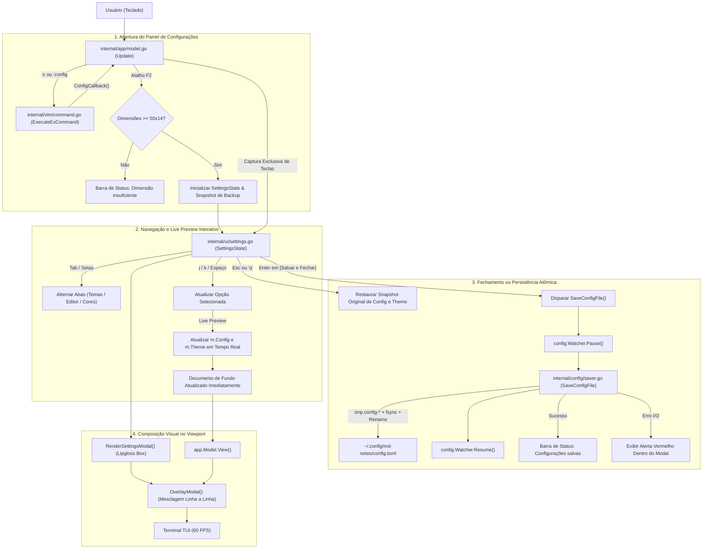

# Especificação Técnica: F08. Interactive Configuration Panel & Settings UI

## 1. Visão Geral Técnica

### O que será implementado
Implementação do painel interativo de configurações e interface visual de preferências do editor **md-notes** (`internal/ui/settings.go` e `internal/app`), proporcionando uma janela modal centralizada e estilizada via Lipgloss, acionada no modo Normal por meio dos comandos Ex `:c` e `:config`, bem como pelo atalho de teclado global `F2`. O painel permite a customização dinâmica de temas visuais incorporados, parâmetros fundamentais do editor (`tab_size`, `line_numbers`, `relative_line_numbers`, `scrolloff`, `word_wrap`) e substituições pontuais de cores hexadecimais (`#RRGGBB`) de syntax highlighting, oferecendo *Live Preview* imediato no documento em segundo plano a 60 FPS, composição de sobreposição suave (*overlay blending*) preservando o documento aberto, e persistência atômica direta no arquivo `config.toml` em diretórios padronizados XDG/AppData sem travamentos ou corrupção de dados.

### Motivação Técnica
Atualmente, a personalização de preferências do `md-notes` requer que o usuário edite o arquivo `config.toml` manualmente em um editor externo ou reinicie a sessão para experimentar combinações de cores e parâmetros de layout.
- O painel de configurações provê uma interface gráfica TUI nativa e elegante diretamente dentro do ciclo de eventos do Bubble Tea, eliminando atritos cognitivos e acelerando a configuração do ambiente de escrita.
- O mecanismo de *Live Preview* dinâmico permite visualizar instantaneamente o contraste do tema e o alinhamento do texto no viewport enquanto o usuário navega na lista de opções, provendo feedback visual em tempo real sem persistir mudanças indesejadas antes da confirmação explícita.
- A persistência atômica via `config.SaveConfigFile` garante gravação segura em disco com `fsync` e renomeação atômica, além de coordenar a pausa temporária do `config.Watcher` para evitar disparos recursivos ou leituras concorrentes durante o salvamento interno.

### Escopo

**Incluído (Core + Full Scope):**
- Invocação e Controle Modal:
  - Abertura de caixa de diálogo centralizada via comandos `:c` e `:config` a partir do modo Normal do Vim Engine (F03).
  - Abertura e fechamento instantâneo via atalho global de teclado `F2` em qualquer modo não bloqueante.
  - Bloqueio estrito de propagação de teclas para o buffer de edição de texto enquanto o modal estiver aberto.
  - Validação de dimensões mínimas do terminal (mínimo 50 colunas x 14 linhas); rejeição amigável com alerta informativo na barra de status em janelas menores.
- Navegação e Abas:
  - Dimensões do diálogo entre 50 e 60 colunas de largura e 14 a 18 linhas de altura, adaptável às dimensões do terminal.
  - Três abas de configuração com navegação cíclica via `Tab`, `Shift+Tab` ou setas direcionais horizontais (`h`/`l` ou `Left`/`Right`):
    - `[1. Temas]`: Navegação e seleção dos 7 temas incorporados (`default-dark`, `default-light`, `dracula`, `nord`, `catppuccin-mocha`, `catppuccin-macchiato`, `monokai`).
    - `[2. Editor]`: Alternância e ajuste de opções do editor (`line_numbers`, `relative_line_numbers`, `tab_size: 2, 4, 8`, `scrolloff: 0 a 10`, `word_wrap`).
    - `[3. Cores]`: Listagem de tokens de destaque com amostra de cor e valor hexadecimal, com campo de edição inline validado por regex (`^#([0-9a-fA-F]{6})$`).
- Live Preview & Gestão de Estado:
  - Captura de snapshot de backup do `Config` e `CompiledTheme` na abertura do diálogo.
  - Atualização em tempo real das preferências do `app.Model` durante a navegação para pré-visualização imediata no viewport de fundo.
  - Restauração instantânea do snapshot original ao fechar com `Esc` ou `q` (cancelamento).
  - Confirmação e gravação atômica em disco no arquivo `config.toml` ao selecionar `[Salvar e Fechar]` ou pressionar `Enter` na confirmação.
- Renderização Visual e Composição de Tela:
  - Molduras arredondadas Lipgloss estilizadas com as cores primárias do tema ativo.
  - Algoritmo de sobreposição linha a linha (*Overlay Blending*): mescla a caixa de diálogo centralizada às linhas renderizadas pelo viewport, mantendo visíveis as margens do documento.
  - Exibição de alertas de erro de gravação em vermelho dentro do próprio diálogo sem fechar a janela modal nem perder alterações pendentes.
- Persistência em Disco e Coordenação com Watcher:
  - Serialização TOML utilizando `pelletier/go-toml/v2`.
  - Gravação atômica por meio de arquivo temporário `.tmp.config-*`, chamada `fsync` e renomeação atômica (`os.Rename`).
  - Pausa e retomada coordenada do `config.Watcher` (`cw.Pause()` / `cw.Resume()`) durante o salvamento interno.

**Excluído:**
- Instalação remota ou download de temas via marketplace/catálogo online pela internet.
- Criação e registro persistente de novos nomes de temas inexistentes no código binário.
- Gerenciamento de múltiplos buffers ou janelas divididas (*split windows*).
- Edição de regras de sintaxe ou regex customizadas de linguagens no painel.

**Preocupações Transversais Integradas:**
- **Consumo de Configurações e Temas (F02):** Acesso à lista de temas embutidos (`theme.BuiltinThemes()`), paletas (`theme.GetPalette`), compilação de estilos Lipgloss (`theme.CompileTheme`) e estruturas de configuração (`config.Config`).
- **Consumo do Vim Engine (F03):** Roteamento do comando Ex `:c` / `:config` a partir de `ExecuteExCommand` via callback assíncrono `ConfigCallback`, e retorno automático ao modo Normal ao fechar o diálogo.
- **Consumo do Viewport e Status Line (F07):** Inspeção de dimensões da janela (`m.Width`, `m.Height`), live preview do gutter (`RelativeNum`), soft-wrap (`WordWrap`) e mensagens na barra de status (`StatusMsg`).

---

## 2. Impacto na Arquitetura

### Componentes Afetados

| Componente / Arquivo | Tipo | Responsabilidade Principal |
|----------------------|------|---------------------------|
| `internal/ui/settings.go` | Novo | Modelo de estado do painel de configurações, navegação entre abas e itens, edição inline de hex, renderização da caixa modal e algoritmo de *overlay blending*. |
| `internal/config/saver.go` | Novo | Serialização atômica do `Config` para TOML, criação de arquivo temporário com `fsync`, preservação de permissões e renomeação atômica `SaveConfigFile`. |
| `internal/vim/command.go` | Modificado | Reconhecimento e execução dos comandos Ex `:c` e `:config` no despachante `ExecuteExCommand`, invocando o callback de configuração. |
| `internal/vim/engine.go` | Modificado | Adição do callback `ConfigCallback func() tea.Cmd` e sua ativação ao processar comandos Ex de configuração. |
| `internal/app/model.go` | Modificado | Integração do ciclo de vida do painel, tratamento do atalho global `F2`, captura prioritária de teclas, snapshot/restauração de live preview, validação de dimensões mínimas e composição visual no método `View()`. |

### Diagrama de Arquitetura e Fluxo de Dados



---

## 3. Decisões Técnicas

| Decisão | Opção Escolhida | Alternativa Considerada | Trade-off / Justificativa |
|---|---|---|---|
| **Localização Arquitetural do Painel** | Componente integrado em `internal/ui` (`internal/ui/settings.go`) orquestrado pelo `app.Model` | Novo pacote independente `internal/settings` com TEA model isolado | Centraliza a renderização de primitivas visuais e caixas de diálogo no pacote `ui` mantendo a hierarquia de dependências limpa (`ui` depende de Lipgloss e tipos de configuração; `app` coordena). Evita proliferação excessiva de micropacotes. |
| **Mecânica de Live Preview** | Snapshot de estado (`ConfigBackup`, `ThemeBackup`) com aplicação em tempo real no `app.Model` durante a navegação | Visualização estática apenas com amostras internas na caixa de diálogo | O live preview no fundo oferece a melhor usabilidade de edição Markdown, permitindo ao usuário checar o contraste real dos títulos H1-H6 e quebra de linhas diretamente no texto antes de decidir salvar. O snapshot garante descarte limpo ao pressionar `Esc`. |
| **Edição de Cores Hexadecimais** | Terceira aba `[3. Cores]` com edição de campo inline e validação regex (`^#([0-9a-fA-F]{6})$`) | Caixa de diálogo secundária suspensa (*nested popup*) | Uma aba dedicada integrada mantém o layout consistente com a navegação do painel, permitindo alternar facilmente entre opções e ver o código hexadecimal ao lado do swatch colorido sem janelas sobrepostas complexas. |
| **Composição Visual de Sobreposição** | Algoritmo de *Overlay Blending* linha a linha no pacote `ui` | Limpeza completa da tela (*full screen clear*) durante o modal | O *Overlay Blending* preserva a integridade das linhas do documento ao redor do modal centralizado, viabilizando o efeito de live preview e garantindo fidelidade visual em 60 FPS sem cintilações (*flicker*). |
| **Persistência Atômica e Watcher** | Função `SaveConfigFile` com escrita em `.tmp.config-*`, `fsync`, `os.Rename` e coordenação com `cw.Pause()` / `cw.Resume()` | Escrita direta via `os.WriteFile` sem pausar o watcher | Garante zero corrupção do arquivo `config.toml` mesmo em quedas de energia e previne loops de recarga infinita disparados pelo `fsnotify` ao gravar internamente. |
| **Tecnologia Primária Detectada** | Go 1.22+ com Bubble Tea (`github.com/charmbracelet/bubbletea` v0.25+) e Lipgloss (`github.com/charmbracelet/lipgloss` v0.9+) | N/A | Pilha padrão estabelecida na arquitetura `mdn`, garantindo binário estático puro sem CGO e compatibilidade multiplataforma. |

---

## 4. Visão Geral de Componentes

### Módulos e Arquivos

#### 1. `internal/ui/settings.go`
- **Novo/Modificado:** Novo
- **Propósito:** Gerenciador do estado de navegação, seleção e renderização da interface gráfica do painel modal de configurações.
- **Responsabilidades:**
  - Definir estruturas `SettingsState`, `SettingsTab`, `EditorField` e `ColorField`.
  - Processar eventos de teclado via `HandleKey(msg tea.KeyMsg, termWidth, termHeight int) (SettingsAction, tea.Cmd)`:
    - Alternância de abas (`Tab`, `Shift+Tab`, `Left`/`Right` ou `h`/`l`).
    - Navegação vertical (`Up`/`Down` ou `k`/`j`).
    - Modificação de valores (`Space`, `Enter`).
    - Edição de hex na aba de cores com validação sintática.
  - Renderizar a caixa modal estilizada com Lipgloss: `RenderSettingsModal(state *SettingsState, theme *theme.CompiledTheme, width, height int) string`.
  - Executar a mesclagem de sobreposição linha a linha: `OverlayModal(backgroundLines []string, modalContent string, termWidth, termHeight int) []string`.

#### 2. `internal/config/saver.go`
- **Novo/Modificado:** Novo
- **Propósito:** Persistência atômica e segura do arquivo de configuração `config.toml`.
- **Responsabilidades:**
  - Implementar `SaveConfigFile(filePath string, cfg *Config) error`:
    - Garantir a existência do diretório pai (`0755`).
    - Serializar `cfg` para formato TOML utilizando `go-toml/v2`.
    - Escrever em arquivo temporário com prefixo `.tmp.config-*` no mesmo diretório.
    - Executar `file.Sync()` para forçar a persistência física no disco.
    - Definir permissões `0644`.
    - Executar `os.Rename` atômico para o destino final `config.toml`.

#### 3. `internal/vim/command.go`
- **Novo/Modificado:** Modificado
- **Propósito:** Estender a execução de comandos Ex para suportar `:c` e `:config`.
- **Responsabilidades:**
  - Atualizar a assinatura de `ExecuteExCommand`:
    - Receber novo parâmetro `configFunc func() tea.Cmd`.
  - Adicionar casos `"c"` e `"config"` no `switch cmdName`:
    - Invocar `configFunc()` e retornar `CommandResult{Cmd: cmd, CloseMode: true}`.

#### 4. `internal/vim/engine.go`
- **Novo/Modificado:** Modificado
- **Propósito:** Expor o ponto de injeção do callback de configuração no motor modal.
- **Responsabilidades:**
  - Adicionar campo `ConfigCallback func() tea.Cmd` na estrutura `Engine`.
  - Repassar `e.ConfigCallback` ao chamar `ExecuteExCommand` dentro de `handleCommandKey`.

#### 5. `internal/app/model.go`
- **Novo/Modificado:** Modificado
- **Propósito:** Coordenar o ciclo de vida do painel, atalhos, live preview, persistência e composição visual no Bubble Tea.
- **Responsabilidades:**
  - Adicionar campos no `Model`:
    - `SettingsOpen bool`
    - `SettingsState *ui.SettingsState`
    - `ConfigBackup *config.Config`
    - `ThemeBackup *theme.CompiledTheme`
  - Conectar o callback `m.Vim.ConfigCallback` para retornar `OpenSettingsMsg{}`.
  - Interceptar o atalho global `F2` em `Update(msg tea.KeyMsg)` para alternar a abertura/fechamento do painel.
  - No tratamento de `OpenSettingsMsg`:
    - Validar se `m.Width >= 50` e `m.Height >= 14`; emitir erro na barra de status se insuficiente.
    - Clonar o estado atual de `m.Config` e `m.Theme` para o backup.
    - Inicializar `m.SettingsState` com os valores correntes do editor.
    - Marcar `m.SettingsOpen = true`.
  - Interceptar e direcionar teclas exclusivamente para `m.SettingsState` enquanto `SettingsOpen == true`.
  - Aplicar mudanças de tema e editor em tempo real no `m.Config`, `m.Theme` e `m.Viewport` para o *Live Preview*.
  - Ao receber ação de salvar: pausar o watcher (`m.ConfigWatcher.Pause()`), salvar em disco, retomar watcher (`m.ConfigWatcher.Resume()`), fechar modal e exibir confirmação.
  - Ao receber ação de cancelar: restaurar `ConfigBackup` e `ThemeBackup`, recalcular estilos e fechar modal.
  - Em `View()`: se `SettingsOpen`, renderizar o modal e aplicar `ui.OverlayModal` sobre as linhas do viewport antes de concatenar com a barra de status.

---

## 5. Contratos de API e Mensagens

### Tipos de Mensagens Internas (Bubble Tea)

```go
package app

// OpenSettingsMsg solicita a abertura do painel de configurações.
type OpenSettingsMsg struct{}

// CloseSettingsMsg solicita o fechamento do painel, revertendo se não salvo.
type CloseSettingsMsg struct {
    Save bool
}

// ConfigSavedMsg indica conclusão com sucesso da gravação atômica em disco.
type ConfigSavedMsg struct {
    FilePath string
}

// ConfigSaveErrorMsg indica falha de I/O ou permissão na gravação.
type ConfigSaveErrorMsg struct {
    Err error
}
```

### Contratos de Ação do Painel (`internal/ui`)

```go
package ui

// SettingsAction representa o comando de transição emitido pela interação com o painel.
type SettingsAction int

const (
    ActionNone SettingsAction = iota
    ActionLivePreviewUpdated   // Valores alterados, requer atualização de preview em tempo real
    ActionSaveAndClose         // Usuário confirmou [Salvar e Fechar]
    ActionCancelAndClose       // Usuário cancelou via Esc ou 'q'
)
```

### Comandos de Invocação e Atalhos

| Entrada | Modo Válido | Condição | Resultado |
|---|---|---|---|
| `:c` + `Enter` | Modo Normal | Terminal >= 50x14 | Abre o modal de configurações centralizado |
| `:config` + `Enter` | Modo Normal | Terminal >= 50x14 | Abre o modal de configurações centralizado |
| `:c` ou `:config` | Modo Normal | Terminal < 50x14 | Exibe na barra de status: `"Dimensão insuficiente (mínimo 50x14) para abrir o painel de configurações"` |
| Tecla `F2` | Qualquer modo não bloqueante | Terminal >= 50x14 | Alterna abertura / fechamento do painel de configurações |
| Tecla `F2` | Qualquer modo não bloqueante | Terminal < 50x14 | Exibe mensagem de dimensões insuficientes |

### Atalhos de Teclado no Painel Ativo

| Tecla / Atalho | Ação |
|---|---|
| `Tab` / `Shift+Tab` | Navega ciclicamente entre as abas `[1. Temas]`, `[2. Editor]` e `[3. Cores]` |
| `h` / `l` ou `Left` / `Right` | Move o foco para a aba anterior / seguinte |
| `j` / `k` ou `Down` / `Up` | Move a seleção vertical entre os itens; ao atingir o final da lista, `j`/`Down` posiciona o foco em `[Salvar e Fechar]` |
| `s` (fora de edição Hex) | Move o foco diretamente para o botão `[Salvar e Fechar]` |
| `Espaço` ou `Enter` | Ativa a opção selecionada: seleciona tema, inverte checkbox booleano ou avança tab_size |
| `e` (na aba Cores) | Inicia o modo de edição inline do código hexadecimal para o token selecionado |
| `Enter` (em edição Hex) | Valida e aplica a nova cor hexadecimal (`#RRGGBB`); emite aviso se inválida |
| `Esc` (em edição Hex) | Cancela a edição do campo de cor atual sem aplicar |
| `Enter` (em `[Salvar e Fechar]`) | Grava atomicamente no `config.toml`, fecha o modal e exibe confirmação no rodapé |
| `Cmd+S` (`⌘S`) / `Super+S` | Atalho direto no macOS para gravar e fechar imediatamente de qualquer aba |
| `Ctrl+S` | Atalho direto multiplataforma (Linux/Windows/macOS) para gravar e fechar imediatamente |
| `Esc` ou `q` (fora de edição Hex) | Fecha o modal imediatamente, desfaz alterações em memória e restaura o snapshot |

### Mensagens de Status e Alertas

| Cenário | Local de Exibição | Mensagem / Formato |
|---|---|---|
| Terminal insuficiente (< 50x14) | Barra de Status | `"Dimensão insuficiente (mínimo 50x14) para abrir o painel de configurações"` |
| Gravação concluída com sucesso | Barra de Status | `"Configurações salvas em config.toml"` |
| Falha de I/O na gravação | Alerta Vermelho no Modal | `"Erro ao gravar config.toml: <detalhes do erro>"` |
| Código Hexadecimal Inválido | Alerta no Rodapé do Modal | `"Código de cor inválido: use formato #RRGGBB"` |

---

## 6. Modelo de Dados e Estruturas em Memória

### Estruturas de Configuração (`internal/ui/settings.go`)

```go
package ui

import (
    "md-notes/internal/config"
    "md-notes/internal/theme"
)

// SettingsTab identifica a aba selecionada no painel.
type SettingsTab int

const (
    TabThemes SettingsTab = iota
    TabEditor
    TabColors
)

// EditorFieldType representa o tipo de controle do editor.
type EditorFieldType int

const (
    FieldToggleBool EditorFieldType = iota // Ex: line_numbers, relative_line_numbers, word_wrap
    FieldTabSize                           // 2 -> 4 -> 8 -> 2
    FieldScrolloff                         // Incremento / decremento numérico (0 a 10)
)

// EditorOption representa um item configurável do editor.
type EditorOption struct {
    Label       string
    Type        EditorFieldType
    Description string
}

// ColorTokenItem representa um token configurável na aba de cores.
type ColorTokenItem struct {
    TokenKey string // Ex: "h1", "bold", "muted", "table_border"
    Label    string // Ex: "Título H1", "Negrito", "Texto Atenuado"
    HexValue string // Ex: "#BD93F9"
}

// SettingsState mantém o estado interativo completo do painel de configurações.
type SettingsState struct {
    ActiveTab        SettingsTab
    ActiveThemeIndex int
    ActiveEditorRow  int
    ActiveColorRow   int
    
    // Lista de opções disponíveis
    AvailableThemes  []string
    EditorOptions    []EditorOption
    ColorTokens      []ColorTokenItem
    
    // Valores de trabalho em edição (cópia mutável)
    WorkingConfig    config.Config
    
    // Estado do modo de edição de cor Hex
    IsEditingHex     bool
    HexInputBuffer   string
    HexInputError    string
    
    // Feedback de erro de persistência em disco
    PersistenceError string
    
    // Foco atual (0: abas, 1: lista de conteúdo, 2: botão salvar)
    FocusArea        int 
}
```

### Regras de Validação e Limites
1. **Dimensões do Terminal:** Largura mínima de 50 colunas e altura mínima de 14 linhas. Se a janela for menor, o modal não é instanciado.
2. **Largura e Altura do Modal:**
   - Largura: `Clamp(termWidth - 8, 50, 60)`
   - Altura: `Clamp(termHeight - 4, 14, 18)`
   - Coordenadas de ancoragem central: `TopY = (termHeight - modalHeight) / 2`, `LeftX = (termWidth - modalWidth) / 2`.
3. **Tamanho de Tabulação (`tab_size`):** Ciclo restrito aos valores aceitos: `2 -> 4 -> 8 -> 2`.
4. **Margem de Rolagem (`scrolloff`):** Limite numérico entre `0` e `10`.
5. **Formato de Cores Hexadecimal:** Expressão regular estrita `^#[0-9a-fA-F]{6}$`. Qualquer valor fora desse padrão é rejeitado na confirmação do campo inline com mensagem visual.

---

## 7. Estratégia de Testes

### Matriz de Testes por Pacote

| Arquivo de Teste | Tipo de Teste | Alvo / Escopo | Meta de Cobertura |
|------------------|---------------|---------------|-------------------|
| `internal/ui/settings_test.go` | Unitário | Navegação por abas, alternância de itens, validação de cores hex, renderização Lipgloss e overlay blending | 90% |
| `internal/config/saver_test.go` | Unitário | Serialização TOML, persistência atômica, criação de diretórios e integridade do arquivo | 90% |
| `internal/vim/command_test.go` | Unitário | Processamento de `:c` e `:config` em `ExecuteExCommand` e ativação de callback | 95% |
| `internal/app/settings_test.go` | Integração | Ciclo completo: abertura via `:config`/`F2`, live preview, restauração com `Esc`, persistência com `Enter` e trava de terminal pequeno | 85% |

### Detalhamento das Funções de Teste

#### `internal/ui/settings_test.go`
- `TestSettingsState_TabNavigation`: Verifica se `Tab` e `Shift+Tab` alternam ciclicamente entre as abas `TabThemes`, `TabEditor` e `TabColors`.
- `TestSettingsState_VerticalNavigation`: Testa se `j`/`k` ou setas navegam na lista de temas respeitando os limites superior e inferior.
- `TestSettingsState_EditorOptionsToggle`: Testa a alternância booleana com `Space` para `line_numbers`, `relative_line_numbers`, `word_wrap` e ciclo de `tab_size` (2, 4, 8).
- `TestSettingsState_ColorHexValidation`: Valida a aceitação de códigos hex válidos (`#BD93F9`, `#1a2b3c`) e rejeição de entradas inválidas (`#XYZ`, `blue`, `#12345`).
- `TestOverlayModal_CenteringAndBlending`: Garante que a mesclagem sobrepõe as linhas do diálogo nas coordenadas centrais exatas sem quebrar ou deslocar o texto ao redor.

#### `internal/config/saver_test.go`
- `TestSaveConfigFile_Success`: Testa a gravação bem-sucedida de um `Config` completo em diretório temporário (`t.TempDir()`), verificando a validade do arquivo TOML gerado.
- `TestSaveConfigFile_CreateParentDir`: Garante que se o diretório pai não existir, a função o cria automaticamente com permissão `0755`.
- `TestSaveConfigFile_PermissionDenied`: Simula diretório somente leitura e valida o retorno de erro formatado com contexto descritivo.

#### `internal/vim/command_test.go`
- `TestExecuteExCommand_Config`: Testa se `:c` e `:config` disparam o `configFunc` e fecham o modo de comando com sucesso.

#### `internal/app/settings_test.go`
- `TestApp_SettingsSmallTerminal`: Testa tentativa de abrir o painel em terminal 40x10, verificando a emissão da mensagem de erro e que o modal permanece fechado.
- `TestApp_SettingsLivePreviewAndCancel`: Abre o painel, altera o tema para `dracula`, verifica se `m.Theme` foi atualizado em tempo real, pressiona `Esc` e valida se o tema anterior foi restaurado.
- `TestApp_SettingsSaveAndPersist`: Abre o painel, altera opções, confirma com `Enter`, valida se `SaveConfigFile` foi acionado e se `m.ConfigWatcher.Pause()` foi respeitado.
- `TestApp_F2ToggleShortcut`: Valida se pressionar `F2` abre o modal a partir do modo Normal e uma segunda pressão de `F2` cancela e fecha o modal.
