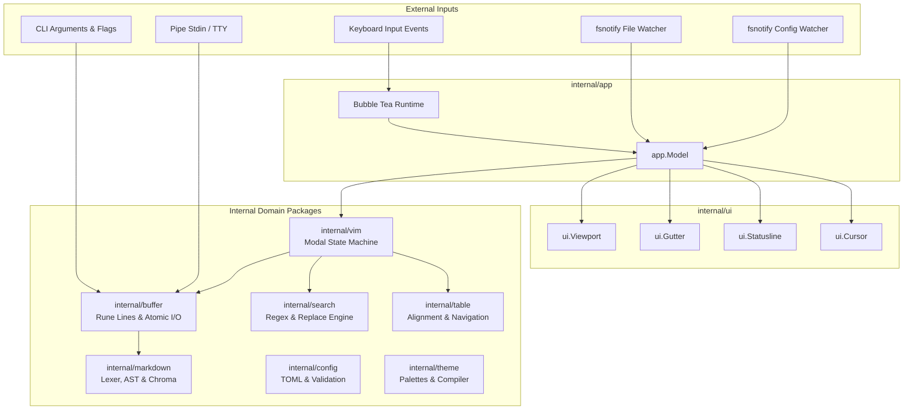

# AGENTS.md — md-notes Architecture and Rules

Context and development guidelines for AI agents, contributors, and developers working on **md-notes** (`mdn`).

> **Language Guidelines**: All Go code developed in this repository must strictly adhere to [go-development-guidelines.md](file:///Users/alexandre/Developer/md-notes/go-development-guidelines.md) for idiomatic styling, error handling, concurrency safety, testing standards, and pre-commit checks.

---

## 1. Project Overview

**md-notes** (`mdn`) is a modern, high-performance, cross-platform terminal Markdown editor and viewer (TUI) built in Go using [Bubble Tea](https://github.com/charmbracelet/bubbletea) and [Lipgloss](https://github.com/charmbracelet/lipgloss).

### Core Goals and Performance Invariants
- **Cold Boot Time**: < 50 ms cold start on standard hardware.
- **Interactive Frame Rate**: < 16 ms render latency (60 FPS feel) during continuous typing, vertical scrolling, and search.
- **Memory Footprint**: < 25 MB resident set size (RSS).
- **Zero Heavy Runtime Dependencies**: Pure Go with `CGO_ENABLED=0`; static standalone binary targeting macOS (`amd64`, `arm64`, `universal`), Linux (`amd64`, `arm64`), and Windows (`amd64`, `arm64`).
- **Non-Destructive Markdown Editing**: Preserves raw Markdown markers (`#`, `**`, `*`, `|`) in the underlying buffer while overlaying real-time ANSI terminal styling.
- **Lossless Atomic Storage**: Zero corruption risk on save via atomic temporary file creation, `fsync`, and atomic rename.

---

## 2. System Architecture

`mdn` is architected around **The Elm Architecture (TEA)** provided by Charm's Bubble Tea, cleanly separating model state, update logic, and view rendering.



### Architectural Pillars

1. **Unidirectional Event Loop**:
   - `app.Model.Update(msg tea.Msg) (tea.Model, tea.Cmd)` is the central coordinator.
   - Keystrokes are delegated to `internal/vim.Engine`, which computes motion, text mutation, or Ex command execution.
   - Visual and line changes update `internal/buffer.Buffer`.

2. **Decoupled Modal State Machine**:
   - Vim emulation (`internal/vim`) is independent of terminal rendering. It receives key messages and triggers buffer mutations or callback commands (`SaveCallback`, `QuitCallback`, `SearchQueryCallback`).

3. **Lossless Document Model**:
   - Text is stored in `internal/buffer.Buffer` as a slice of `buffer.Line` structs.
   - Each `buffer.Line` stores text as `[]rune` to correctly handle multi-byte UTF-8 code points and emoji sequences.

4. **Resilient Atomic I/O**:
   - File writes write to `.tmp.mdn-*` in the target directory, flush buffer contents, invoke `fsync()`, preserve original permissions (`chmod`), and perform an atomic `os.Rename()`.

5. **Dual File Watcher System**:
   - `internal/watcher.Watcher`: Monitors active file on disk. If modified externally without unsaved buffer changes, reloads immediately; if buffer is dirty, warns the user without overwriting. Pauses during internal saves to avoid self-triggering loops.
   - `internal/config.Watcher`: Monitors `~/.config/md-notes/config.toml` (or platform equivalent) for live hot-reloading of themes and editor preferences without restarting the editor.

---

## 3. Directory Layout and Package Responsibilities

```
md-notes/
├── cmd/
│   └── mdn/
│       ├── main.go            # CLI entry point, flag parsing, TTY redirection, Bubble Tea bootstrap
│       └── main_test.go       # Acceptance tests for version, help, pipe, and arguments
├── internal/
│   ├── app/                   # Top-level Bubble Tea Model (Init, Update, View orchestration)
│   ├── buffer/                # Text buffer, UTF-8 Line representation, cursor tracking, atomic I/O
│   ├── config/                # TOML configuration loader, schema defaults, validation, hot-reload
│   ├── markdown/              # Markdown lexer, token AST, Chroma syntax highlighting, inline spans
│   ├── search/                # Literal/regex search, forward/backward navigation, match highlighting, :s replace
│   ├── table/                 # Markdown table detection, runewidth column formatting, cell navigation
│   ├── theme/                 # Palettes (Dracula, Nord, etc.), Lipgloss styles compilation, terminal detection
│   ├── ui/                    # Viewport scrolling, gutter (line numbers), statusline, cursor rendering
│   ├── vim/                   # Vim modal engine, motions, operators, Ex commands, undo/redo, registers
│   └── watcher/               # fsnotify file change watcher with Pause/Resume coordination
├── scripts/
│   └── build.go               # Pure Go cross-platform compilation & packaging script
├── docs/                      # PRD, architectural specifications, build guides
├── Makefile                   # Make build automation shortcuts
├── go.mod                     # Go module definitions
├── go.sum                     # Cryptographic checksums of dependencies
├── go-development-guidelines.md # Comprehensive Go coding and style guidelines
└── AGENTS.md                  # This file
```

### Package Deep Dive

| Package | Primary Files | Key Responsibilities |
| :--- | :--- | :--- |
| [`cmd/mdn`](file:///Users/alexandre/Developer/md-notes/cmd/mdn/main.go) | `main.go`, `main_test.go` | Entrypoint; checks `-v`/`-h`; inspects `stdin` mode (`os.ModeCharDevice`); re-opens `/dev/tty` or `CONIN$` for TUI input when piping; wires watchers to `tea.Program`. |
| [`internal/app`](file:///Users/alexandre/Developer/md-notes/internal/app/model.go) | `model.go`, `model_test.go` | Root `tea.Model`; coordinates `WindowSizeMsg`, `SaveFileMsg`, `QuitMsg`, `ThemeReloadedMsg`, and `FileModifiedMsg`; connects Vim callbacks to TEA commands; executes `View()` assembly. |
| [`internal/buffer`](file:///Users/alexandre/Developer/md-notes/internal/buffer/buffer.go) | `buffer.go`, `line.go`, `io.go` | In-memory text storage using `[]Line`; multi-byte UTF-8 rune manipulation (`InsertAt`, `DeleteAt`, `SplitAt`); `AtomicSave` with fsync and permission preservation; `Cursor` tracking. |
| [`internal/vim`](file:///Users/alexandre/Developer/md-notes/internal/vim/engine.go) | `engine.go`, `state.go`, `motion.go`, `command.go`, `history.go`, `clipboard.go` | Modal state machine (`Normal`, `Insert`, `VisualChar`, `VisualLine`, `VisualBlock`, `Command`, `Search`); count multipliers; motions (`h/j/k/l`, `w/b/e`, `0/$`, `gg/G`, `f/F/t/T`); undo/redo history; Ex parser. |
| [`internal/markdown`](file:///Users/alexandre/Developer/md-notes/internal/markdown/parser.go) | `parser.go`, `lexer.go`, `token.go`, `highlighter.go` | Non-destructive tokenization; generates `TokenizedLine` with `StyledSpan` items; formats headers, bold, italic, quotes, lists, and checkboxes; uses Chroma for fenced code blocks. |
| [`internal/table`](file:///Users/alexandre/Developer/md-notes/internal/table/table.go) | `table.go`, `parser.go`, `formatter.go`, `renderer.go`, `navigation.go` | Detects Markdown table blocks (`|---|`); computes visual widths using `go-runewidth`; dynamic re-alignment; cell navigation with Tab/Shift-Tab. |
| [`internal/search`](file:///Users/alexandre/Developer/md-notes/internal/search/engine.go) | `engine.go`, `match.go`, `pattern.go`, `replace.go`, `interactive.go` | Regex and literal matching; incremental search; forward (`/`) and backward (`?`); navigation (`n`/`N`); regex substitution (`:s/find/replace/g`, `:%s`). |
| [`internal/theme`](file:///Users/alexandre/Developer/md-notes/internal/theme/palette.go) | `palette.go`, `compiler.go`, `detect.go` | Built-in palettes (`default-dark`, `default-light`, `dracula`, `nord`, `catppuccin`, `monokai`); overrides parsing; compiles raw hex into `lipgloss.Style` objects. |
| [`internal/config`](file:///Users/alexandre/Developer/md-notes/internal/config/config.go) | `config.go`, `loader.go`, `watcher.go` | Cross-platform XDG/AppData configuration paths; TOML parsing; defaults; configuration hot-reloading with debounced `fsnotify`. |
| [`internal/ui`](file:///Users/alexandre/Developer/md-notes/internal/ui/viewport.go) | `viewport.go`, `gutter.go`, `statusline.go`, `cursor.go`, `scrollbar.go` | Scrolling math; relative and absolute line numbers; status bar layout (mode, file, dirty indicator, coordinates, percentage); terminal cursor position calculation. |
| [`internal/watcher`](file:///Users/alexandre/Developer/md-notes/internal/watcher/watcher.go) | `watcher.go` | Monitors open file for external changes (`fsnotify`); dispatches `FileModifiedMsg`; exposes `Pause()` and `Resume()` for safe internal saves. |

---

## 4. Key Data Structures and Invariants

### 1. `buffer.Buffer` and `buffer.Line`
- `Buffer` is thread-safe for reading and writing via `sync.RWMutex`.
- Coordinates are 0-indexed internally: `Cursor{Line: 0, Col: 0}`.
- `Line.Runes` contains Unicode runes. Always use `Length()` (number of runes), not byte count, when calculating cursor positions and line slices.
- `Line.Ending` captures the original newline format (`\n` or `\r\n`) so saving does not alter existing line endings on Windows or Unix.

### 2. `vim.Engine` and `vim.ModalState`
- Current mode is tracked in `ModalState.CurrentMode`:
  - `ModeNormal`: Navigation, operator commands, count accumulation.
  - `ModeInsert`: Direct character insertion and backspace.
  - `ModeVisualChar` / `ModeVisualLine` / `ModeVisualBlock`: Active text selections.
  - `ModeCommand`: Ex command line prompt (`:`).
  - `ModeSearch`: Incremental regex search prompt (`/` or `?`).
- Multipliers: Entering digits `1-9` in normal mode accumulates `countAccum` to repeat subsequent motions and operators (e.g. `5dd`, `3w`).
- Undo/Redo: Buffer snapshots are stored in `History` ring buffer (depth: 200). Mutations in insert mode record a snapshot upon entering and exiting insert mode.

### 3. Non-Destructive Markdown Representation
- `markdown.TokenizedLine` contains:
  - `Original buffer.Line`: The raw unmolested line.
  - `Spans []StyledSpan`: The segmented pieces formatted with `lipgloss.Style`.
- Markdown markers (`#`, `*`, `` ` ``) are styled using `theme.Muted` rather than deleted, allowing developers to see and edit the Markdown syntax naturally.

### 4. Table Handling with `go-runewidth`
- Never compute table column widths using `len(string)` or `len([]rune)`. Terminal characters can be double-width (East Asian characters, emojis).
- All visual width calculations must use `runewidth.StringWidth(trimmed)` from `github.com/mattn/go-runewidth`.

---

## 5. Coding and Contribution Rules for Agents

When implementing features, fixing bugs, or refactoring in this repository, you must adhere to the following rules:

### A. Language & Code Standards
1. **Follow the Guideline**: Adhere strictly to [go-development-guidelines.md](file:///Users/alexandre/Developer/md-notes/go-development-guidelines.md).
2. **Formatting**: Always run `gofmt` on any modified Go files.
3. **Static Analysis**: Ensure `go vet ./...` passes without warnings.
4. **Imports**: Keep standard library imports separated from third-party imports in distinct groups.
5. **No Package Cycles**: Ensure clean dependencies. `internal/buffer` and `internal/theme` must never depend on `internal/app` or `internal/vim`.

### B. Error Handling
1. Treat errors as values; never ignore errors with `_ = ...` without explicit justification in a comment.
2. Wrap errors with descriptive operation context using `%w`:
   ```go
   if err := os.Rename(tempPath, savePath); err != nil {
       return fmt.Errorf("atomic rename from %s to %s: %w", tempPath, savePath, err)
   }
   ```
3. Do not panic in library or internal packages. Reserve panic solely for unrecoverable initialization bugs in `main.go`.

### C. Concurrency and Mutex Safety
1. When modifying `buffer.Buffer`, lock with `b.mu.Lock()` and unlock with `defer b.mu.Unlock()`.
2. When launching background goroutines, ensure an explicit termination mechanism exists via `context.Context` or channel closure. Never leak goroutines.
3. Test concurrent code with the race detector enabled (`go test -race ./...`).

### D. Testing Requirements
1. Every new function, parser improvement, or Vim motion must have accompanying unit tests.
2. Structure tests as **table-driven tests** with subtests (`t.Run(tc.name, ...)`).
3. Use `t.Parallel()` where appropriate to optimize test suite execution.
4. Use `t.TempDir()` for all tests that interact with the filesystem.
5. Keep global test coverage above 70% on domain packages (`buffer`, `vim`, `markdown`, `table`, `search`).

---

## 6. Essential Development Commands

### Building and Running
```bash
# Build binary for the current host architecture into bin/mdn
make build

# Build standalone binaries for all supported platforms (macOS, Linux, Windows)
make build-all
# Or run using the pure Go build script:
go run scripts/build.go

# Build macOS Universal Binary (combines amd64 and arm64 via lipo)
make universal-darwin

# Package release archives (.tar.gz, .zip) with sha256 checksums in dist/
make package
```

### Testing and Validation
```bash
# Run all unit tests
make test

# Run unit tests with data race detector
go test -race ./...

# Run specific test in a package
go test -v -run TestBufferAtomicSave ./internal/buffer

# Run unit tests with HTML coverage report
make test-coverage

# Run benchmarks with memory allocation metrics
go test -bench=. -benchmem ./internal/markdown/...
```

### Formatting, Linting and Dependency Management
```bash
# Format all Go source files
make fmt

# Run official go vet analyzer
make vet

# Tidy module dependencies
make tidy

# Clean compiled binaries and coverage outputs
make clean
```

---

## 7. Configuration Reference (`config.toml`)

`md-notes` loads configuration from `$XDG_CONFIG_HOME/md-notes/config.toml` (Linux/macOS) or `%APPDATA%\md-notes\config.toml` (Windows).

```toml
# Active color theme (default-dark, default-light, dracula, nord, catppuccin, monokai)
theme = "dracula"

[editor]
tab_size = 4
line_numbers = true
relative_line_numbers = false
scrolloff = 4
word_wrap = true

[colors]
# Optional theme token color overrides (hex format)
# h1 = "#BD93F9"
# bold = "#FF79C6"
# table_border = "#6272A4"
```
