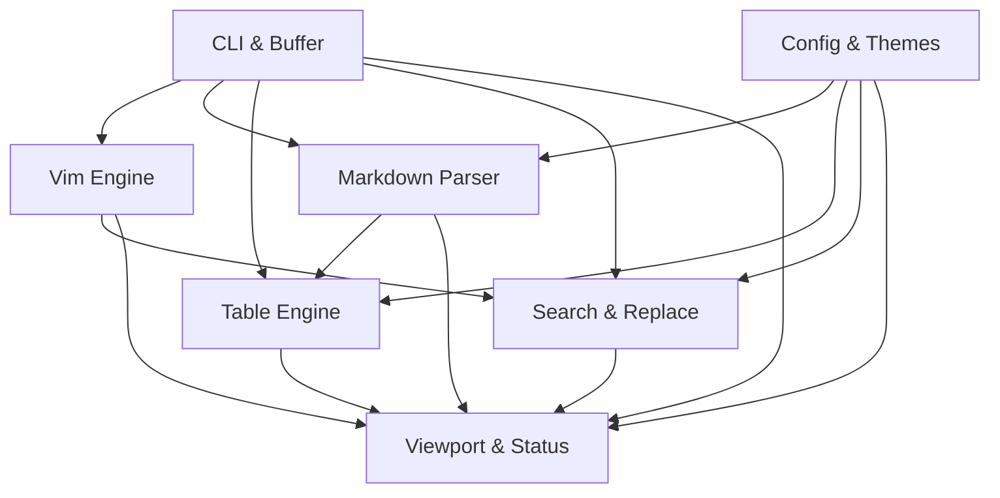

# md-notes

## 1. Executive Summary

O **md-notes** é um editor de Markdown nativo para terminal (TUI - Terminal User Interface) projetado para oferecer agilidade e praticidade extrema no fluxo de trabalho de desenvolvedores e profissionais técnicos. Criado para quem já opera no terminal em conjunto com assistentes de IA (como Antigravity CLI, Codex, Claude Code e Aider), o produto elimina a lentidão e o atrito de alternar para editores gráficos pesados ou ferramentas web apenas para inspecionar, revisar ou redigir documentos Markdown.

O público-alvo principal são desenvolvedores de software, engenheiros de DevOps/SRE e criadores de documentação técnica que prezam por ergonomia de teclado, resposta instantânea e estética refinada na linha de comando. O diferencial central reside na combinação de uma experiência modal inspirada no padrão Vim (`i`, `v`, `/`, `:w`, `:wq`) com um motor de renderização e destaque de sintaxe em tempo real, permitindo visualizar títulos estilizados, ênfases (negrito/itálico), tabelas perfeitamente alinhadas e blocos de código formatados sem ocultar as marcações Markdown originais.

Construído em Go com a biblioteca Bubble Tea e Lipgloss, o **md-notes** compila para um binário nativo único e independente, com suporte multiplataforma (macOS, Linux e Windows), inicialização em menos de 50 milissegundos, consumo mínimo de memória (< 25 MB) e suporte total a arquivos de configuração TOML com paletas de cores modernas (Dracula, Nord, Catppuccin, Monokai e temas customizados).

## 2. Problem and Opportunity

### The Problem

- **Atrito na alternância de contexto (Context Switching):** Desenvolvedores trabalhando em fluxos baseados em terminal e ferramentas de IA perdem de 5 a 15 segundos a cada transição para navegadores ou IDEs pesadas apenas para ler ou fazer pequenos ajustes em arquivos `.md` gerados.
- **Falta de formatação visual em editores de terminal tradicionais:** Editores padrão de terminal como Nano ou Vi padrão exibem texto markdown cru monocromático sem hierarquia visual, tornando a leitura de documentos extensos cansativa e propensa a erros de interpretação.
- **Dificuldade de edição e visualização de tabelas Markdown:** Tabelas em arquivos Markdown são notoriamente difíceis de editar manualmente no terminal, frequentemente quebrando alinhamentos de colunas e pipes (`|`), o que exige reformatadores externos.
- **Curva de aprendizado ou configurações complexas:** Configurar plugins avançados de Markdown no Neovim/Emacs consome horas de setup e gera incompatibilidades, enquanto editores simples não oferecem comandos de navegação rápidos (`/`, `:w`, `dd`, `yy`).

### The Opportunity

- **Visualização rica em tempo real no terminal:** O **md-notes** processa a sintaxe Markdown dinamicamente, aplicando cores, pesos tipográficos e bordas decorativas imediatamente ao digitar ou navegar, sem exigir modos de compilação ou janelas secundárias de visualização.
- **Ergonomia modal nativa do Vim:** Proporciona navegação imediata com atalhos universais conhecidos (`h/j/k/l`, `w`, `b`, `gg`, `G`, `0`, `$`, `x`, `dd`, `yy`, `p`, `u`, `Ctrl+r`, `:w`, `:q`, `:wq`), permitindo que usuários experientes de terminal sejam produtivos desde o primeiro segundo.
- **Alinhamento automático inteligente de tabelas:** O motor de tabelas ajusta larguras de colunas e espaçamentos dinamicamente durante a digitação de pipes (`|`), garantindo tabelas visualmente elegantes no terminal e arquivos `.md` perfeitamente estruturados em disco.
- **Integração total com pipelines e ferramentas de IA no terminal:** Suporte nativo para abrir arquivos diretamente (`mdn doc.md`), iniciar buffers scratchpad temporários (`mdn`) e ler saídas de pipes (`cat output.md | mdn`), agilizando a inspeção de respostas de LLMs.

## 3. Target Audience

### Primary Users

**Desenvolvedor CLI & Power User de IA**
- Opera predominantemente no terminal com assistentes de IA (Antigravity CLI, Claude Code, Codex, Aider) gerando planos, especificações e documentações em Markdown.
- Exige velocidade instantânea de abertura de arquivos e atalhos de teclado do Vim para editar sem encostar no mouse.
- Valoriza clareza visual imediata para validar a estrutura hierárquica de títulos, listas e tabelas geradas por IA.

**Engenheiro DevOps / SRE**
- Cria e mantém runbooks, post-mortems, READMEs de infraestrutura e documentações de arquitetura diretamente em servidores locais ou remotos.
- Necessita de um binário único e leve, sem dependências de Node.js, Python ou bibliotecas gráficas pesadas.
- Prioriza estabilidade, suporte multiplataforma consistente e integridade na gravação de arquivos.

### Behavioral Profile

- Utiliza emuladores de terminal modernos (iTerm2, Alacritty, Kitty, WezTerm, Windows Terminal) com fontes tipográficas que suportam símbolos (Nerd Fonts) e cores Truecolor (24-bit).
- Possui memória muscular estabelecida com atalhos de navegação e comandos ex do Vim.
- Customiza seu ambiente de desenvolvimento via arquivos de configuração baseados em texto (dotfiles).

## 4. Objectives

### Product Objectives

- **Entregar inicialização instantânea no terminal:** Iniciar o editor e renderizar qualquer arquivo Markdown em menos de 50 milissegundos a partir da invocação na linha de comando.
- **Fornecer renderização Markdown em tempo real:** Formatar títulos, ênfases tipográficas e tabelas na tela durante a edição com latência de resposta inferior a 16 milissegundos (60 FPS) sem ocultar marcadores estruturais.
- **Garantir emulação ergonômica de comandos do Vim:** Implementar 100% dos comandos essenciais de navegação, edição modal, busca e manipulação de arquivos do padrão Vim.
- **Oferecer customização visual completa via TOML:** Permitir a alternância entre 7 temas pré-configurados e a definição de esquemas de cores customizados em RGB Truecolor.

### Success Metrics

- **Tempo de Inicialização (Cold Start):** Inferior a 50 ms medido em arquivos de até 1.000 linhas em hardware padrão (Apple Silicon / Intel x86_64).
- **Taxa de Renderização Interativa:** Latência de atualização de frame inferior a 16 ms em operações de digitação contínua e rolagem vertical.
- **Fidelidade de Parsing e Salvamento:** 0% de corrupção ou perda de dados em operações de leitura e gravação de arquivos Markdown com tabelas e caracteres UTF-8.
- **Tamanho do Binário Compilado:** Binário único compilado com tamanho inferior a 25 MB e consumo de memória RAM em execução inferior a 30 MB.

## 5. User Stories

### F01. CLI Entrypoint & File Buffer Manager
- As a user, I want to execute `mdn arquivo.md` so that existing files are opened immediately or a new buffer is initialized if the file does not exist.
- As a user, I want to execute `mdn` without arguments so that an empty scratchpad buffer opens for quick note-taking.
- As a user, I want to pipe command output into `mdn` (`cat doc.md | mdn`) so that I can inspect and edit CLI tool and AI agent outputs directly.
- As a user, I want to be prompted when trying to quit with unsaved changes so that I do not accidentally lose edits.

### F02. Configuration & Theme Engine
- As a user, I want the editor to automatically load my configuration from `~/.config/md-notes/config.toml` so that my color palette and preferences are applied.
- As a user, I want to easily switch between built-in themes (`dracula`, `nord`, `catppuccin-mocha`, `catppuccin-macchiato`, `monokai`, `default-dark`, `default-light`) so that the editor matches my terminal aesthetics.
- As a user, I want to specify custom RGB/Hex colors in the TOML file so that I can fine-tune syntax highlighting and interface elements.

### F03. Modal Editing Engine (Vim Emulation)
- As a user, I want to navigate using standard Vim keys (`h`, `j`, `k`, `l`, `w`, `b`, `0`, `$`, `gg`, `G`) in Normal mode so that I can move the cursor quickly without a mouse.
- As a user, I want to switch to Insert mode using `i`, `a`, `I`, `A`, `o`, `O` and return to Normal mode with `Esc` so that I can type and edit text naturally.
- As a user, I want to select text in Visual mode (`v`, `V`), copy (`y`) and delete (`d`) with automatic system clipboard synchronization.
- As a user, I want to execute ex commands (`:w`, `:q`, `:wq`, `:q!`, `:w <filename>`) so that I can save and exit following standard Vim patterns.
- As a user, I want to undo (`u`) and redo (`Ctrl+r`) edits so that I can safely revert or reapply changes.

### F04. Live Markdown Syntax Parser & Highlighting
- As a user, I want heading lines (`#` through `######`) to be formatted with hierarchical colors and bold styling immediately as I type.
- As a user, I want markdown syntax markers (`#`, `**`, `*`, `_`, `` ` ``) to remain visible with dimmed styling while inner text receives rich styling.
- As a user, I want code blocks delimited by triple backticks (```) to display with distinct background styling and syntax coloring.
- As a user, I want list items (`- `, `* `, `1. `) and blockquotes (`> `) to render with proper indentation and visual hierarchy in real time.

### F05. Dynamic Markdown Table Engine
- As a user, I want to type table rows containing pipes (`|`) and have the editor automatically align columns and headers in real time.
- As a user, I want table borders to render with clean box/grid styling and theme-appropriate colors.
- As a user, I want tables to preserve standard Markdown format and proper column spacing when saved to disk.

### F06. Interactive Search & Replace System
- As a user, I want to press `/` in Normal mode, type a query, and see all matching occurrences highlighted in the viewport in real time.
- As a user, I want to navigate between search matches forward (`n`) and backward (`N`) jumping directly to the match position.
- As a user, I want to execute search and replace commands (`:s/old/new/g`, `:%s/old/new/g`) across lines or the entire buffer.

### F07. TUI Viewport & Status Line Renderer
- As a user, I want to see an informative status bar showing the current mode, filename, dirty status `[+]`, line/column coordinates, and scroll percentage.
- As a user, I want smooth vertical and horizontal viewport scrolling with customizable line numbering.
- As a user, I want the editor layout to respond dynamically to terminal resize events without visual glitches.

## 6. Functionalities

### F01. CLI Entrypoint & File Buffer Manager

**Provides:**
- Buffer state contendo caminho do arquivo, linhas de texto brutas, flag de modificação (dirty), posição do cursor e modo de entrada (used by F03, F04, F05, F06, F07)

**Core Scope:**
- Leitura e abertura de arquivos de disco no caminho especificado via CLI
- Criação de novo buffer vazio para arquivos inexistentes ou quando nenhum argumento for fornecido
- Leitura de conteúdo via stdin/pipe (`cat arquivo.md | mdn`)
- Gravação atômica do buffer em disco mantendo permissões de arquivo originais e encoding UTF-8
- Detecção e aviso de buffer não salvo ao solicitar encerramento

**Full Scope additions:**
- Recarregamento automático de arquivo modificado externamente por outro processo
- Criação automática de diretórios pais inexistentes ao salvar `:w novo/caminho/arquivo.md`

**Capabilities:**
- Suporte a arquivos de até 10 MB ou 50.000 linhas em memória com fluidez de edição
- Encoding estrito em UTF-8 com preservação de line endings (`\n` e `\r\n`)
- Gravação atômica em disco utilizando escrita em arquivo temporário seguida de rename para evitar corrupção

**Experience:**
- Invocação via terminal: `mdn` ou `mdn [caminho]`.
- Se o arquivo existir, lê e preenche o buffer posicionando o cursor na linha 1, coluna 1.
- Se o arquivo não existir, exibe mensagem informativa `[Novo Arquivo]` na barra de status.
- Se receber dados por pipe, lê o stdin até EOF e inicializa o buffer como `[Stdin Buffer]`.
- Ao executar `:w`, grava o conteúdo em disco e remove o indicador `[+]` de modificado.
- Ao executar `:q` com alterações pendentes, bloqueia a saída e exibe o alerta: `E37: Alterações não salvas. Use :w para salvar ou :q! para forçar a saída`.

**Error Handling:**
- **Falha de permissão de leitura:** Se o arquivo não puder ser lido, o editor encerra imediatamente antes de entrar no modo TUI com código de saída 1 e mensagem: `Erro: Permissão negada ao abrir '<caminho>'`.
- **Falha de gravação de disco:** Se o disco estiver cheio ou sem permissão de escrita ao executar `:w`, o editor mantém o buffer intacto e exibe na barra de status: `Erro: Não foi possível gravar o arquivo em '<caminho>': Permissão negada`.
- **Tentativa de salvar buffer sem nome:** Ao executar `:w` em um buffer criado sem caminho, exibe: `Erro: Nenhum nome de arquivo definido. Use :w <caminho>`.

---

### F02. Configuration & Theme Engine

**Provides:**
- Theme styling definitions e configurações ativas de exibição (cores H1-H6, marcadores atenuados, negrito, itálico, bordas de tabela, cursor, linha de status) (used by F04, F05, F06, F07)

**Core Scope:**
- Carregamento de arquivo TOML de configuração em diretórios padrão XDG (`~/.config/md-notes/config.toml` no Linux/macOS e `%APPDATA%\md-notes\config.toml` no Windows)
- Criação automática do arquivo padrão com comentários explicativos caso não exista
- 7 temas pré-definidos incorporados: `dracula`, `nord`, `catppuccin-mocha`, `catppuccin-macchiato`, `monokai`, `default-dark`, `default-light`
- Definição customizada de cores via código Hex (`#RRGGBB`) ou paleta ANSI 256 cores
- Configurações booleanas para exibição de numeração de linhas e largura de tabulação (padrão: 2 ou 4 espaços)

**Full Scope additions:**
- Hot-reload do arquivo de configuração ao ser alterado em disco sem reiniciar o editor
- Suporte a temas claros/escuros sincronizados com o sinal de preferência do terminal (Dark/Light mode detection)

**Capabilities:**
- Arquivo de configuração em formato TOML padronizado
- Resolução e compilação de estilos Lipgloss em menos de 5 ms na inicialização
- Fallback seguro para o tema padrão caso o arquivo de configuração contenha erros de sintaxe

**Experience:**
- Na inicialização, busca o arquivo de configuração no caminho XDG.
- Se o arquivo existir, faz o parse do TOML e compila os estilos de cor para componentes e tokens Markdown.
- Se o arquivo não existir, gera o `config.toml` padrão com documentação e aplica o tema `default-dark`.
- Em caso de chave inválida ou erro de sintaxe no TOML, inicia normalmente com o tema padrão e exibe aviso de advertência não bloqueante no rodapé.

---

### F03. Modal Editing Engine (Vim Emulation)

**Consumes:**
- F01: Buffer state (caminho do arquivo, linhas de texto brutas, flag de modificação, posição do cursor)

**Provides:**
- Modal state contendo modo ativo (NORMAL, INSERT, VISUAL, COMMAND), seleção visual ativa, pilha de Undo/Redo, comando em digitação e padrão de busca (used by F06, F07)

**Core Scope:**
- Modos de operação: Normal, Insert, Visual (por caractere `v` e por linha `V`), Command-line (`:`)
- Movimentação no modo Normal: `h` (esquerda), `j` (baixo), `k` (cima), `l` (direita), `w` (próxima palavra), `b` (palavra anterior), `0` (início da linha), `$` (fim da linha), `gg` (início do documento), `G` (fim do documento)
- Comandos de entrada no modo Insert: `i` (antes do cursor), `a` (após o cursor), `I` (início da linha), `A` (fim da linha), `o` (nova linha abaixo), `O` (nova linha acima), `Esc` (retorno ao Normal)
- Operações de edição e deleção: `x` (apagar caractere), `dd` (apagar linha inteira), `dw` (apagar palavra), `yy` (copiar linha), `yw` (copiar palavra), `p` (colar após cursor), `P` (colar antes do cursor)
- Pilha de Desfazer (`u`) e Refazer (`Ctrl+r`) com histórico de até 200 estados de edição
- Sincronização automática com a área de transferência do sistema operacional ao executar `yy`, `y` (em modo Visual), `dd`, `d` e `p`
- Execução de comandos ex: `:w`, `:w <nome>`, `:q`, `:wq`, `:q!`

**Full Scope additions:**
- Modos visuais em bloco (`Ctrl+v`)
- Suporte a contadores numéricos de repetição (ex: `5j`, `3dd`, `10w`)
- Comandos de busca de caractere na linha (`f<char>`, `F<char>`, `t<char>`, `T<char>`)

**Capabilities:**
- Transição de modos de teclado com latência inferior a 1 ms
- Histórico de desfazer/refazer com limite de 200 checkpoints por buffer
- Suporte total a caracteres multibyte (UTF-8) em cálculos de deslocamento de cursor

**Experience:**
- O editor inicia sempre em modo **NORMAL**. O cursor é exibido em bloco sólido (`█`).
- Ao pressionar `i`, a barra de status muda para `-- INSERT --`, o cursor passa para barra vertical (`|`), e qualquer tecla digitada insere caracteres na posição atual.
- Pressionar `Enter` no modo Insert insere quebra de linha `\n` e posiciona o cursor na coluna correta da nova linha.
- Pressionar `Esc` retorna imediatamente para o modo **NORMAL**.
- Pressionar `v` entra em modo `-- VISUAL --` e destaca o bloco de caracteres conforme o cursor se move; pressionar `y` copia o texto selecionado para o clipboard do SO e retorna para o modo Normal.
- Pressionar `:` entra em modo `-- COMMAND --`, posiciona o cursor na barra inferior e aguarda digitação do comando (`w`, `q`, `wq`, etc.) seguido de `Enter`.
- Pressionar `u` reverte a última alteração e posiciona o cursor na posição correspondente.

**Error Handling:**
- **Comando Ex desconhecido:** Se o usuário digitar um comando inválido (ex: `:foo`), exibe na linha de comando: `E492: Não é um comando de editor: foo`.
- **Fim da pilha de Undo:** Ao pressionar `u` sem alterações anteriores, exibe: `Já na alteração mais antiga`.
- **Fim da pilha de Redo:** Ao pressionar `Ctrl+r` sem alterações futuras, exibe: `Já na alteração mais recente`.

---

### F04. Live Markdown Syntax Parser & Highlighting

**Consumes:**
- F01: Buffer state (linhas de texto brutas, posição do cursor)
- F02: Theme styling definitions e configurações ativas de exibição

**Provides:**
- Linhas tokenizadas e estilizadas com tags de formatação e marcadores atenuados para renderização no viewport (used by F05, F07)

**Core Scope:**
- Destaque hierárquico de títulos Markdown (`#` H1 a `######` H6) com cores distintas por nível e estilo em negrito
- Exibição de marcadores estruturais (`#`, `##`, `**`, `*`, `_`, `~~`, `` ` ``) com tom atenuado (dimmed / muted) preservando a integridade textual
- Formatação estilizada em tempo real de textos delimitados: `**negrito**` (bold), `*itálico*` ou `_itálico_` (italic), `~~tachado~~` (strikethrough), `` `código inline` `` (fundo e cor de destaque)
- Blocos de código delimitados por crases triplas (```) com fundo visual diferenciado e destaque de palavras-chave
- Listas não ordenadas (`- `, `* `, `+ `), listas ordenadas (`1. `) e checkboxes (`- [ ]`, `- [x]`)
- Citações em bloco (`> `) com barra vertical decorativa estilizada

**Full Scope additions:**
- Syntax highlighting completo com reconhecimento de linguagem em blocos de código (Go, Python, JS/TS, Rust, JSON, YAML, Bash) via Chroma/Tree-sitter
- Renderização e link clickable para URLs (`https://...` e `[texto](url)`)

**Capabilities:**
- Parsing incremental de linhas visíveis no viewport para renderização a 60 FPS
- Tokenização em memória sem alocação excessiva de strings temporárias
- Suporte a formatações aninhadas (ex: `**texto em negrito com `código` e *itálico***`)

**Experience:**
- O usuário digita `# Introdução ao Projeto` em modo Insert.
- Ao pressionar `Enter` ou mover o cursor, a linha imediatamente recebe a cor e o estilo de H1 do tema ativo, enquanto o caractere `#` recebe o tom atenuado configurado.
- Ao digitar `Este é um texto em **negrito** e *itálico*`, as palavras `negrito` e `itálico` são renderizadas respectivamente em negrito e itálico na tela, enquanto os asteriscos `**` e `*` aparecem em tom dimmed.
- Ao digitar um bloco de código ````go ... ````, as linhas intermediárias recebem recuo visual e cor de fundo destacada da área de texto comum.

---

### F05. Dynamic Markdown Table Engine

**Consumes:**
- F01: Buffer state (linhas de texto brutas, posição do cursor)
- F02: Theme styling definitions e configurações ativas de exibição
- F04: Linhas tokenizadas e estilizadas

**Provides:**
- Blocos de tabelas alinhados e estilizados para o viewport (used by F07)

**Core Scope:**
- Detecção automática de blocos de tabela Markdown delimitados por pipes (`|`) e linhas de cabeçalho (`|---|---|`)
- Cálculo em tempo real da largura máxima de cada coluna baseado no conteúdo das células
- Alinhamento automático inteligente das colunas no buffer visual durante a digitação e navegação
- Renderização de caracteres de borda e separação com estilos do tema ativo
- Suporte a alinhamento de texto especificado no cabeçalho Markdown (`:---` à esquerda, `:---:` ao centro, `---:` à direita)
- Preservação da formatação padrão Markdown ao gravar o arquivo em disco

**Full Scope additions:**
- Atalho modal ou comando ex para inserir template de tabela `:table 3 4` (3 colunas, 4 linhas)
- Navegação entre células via tecla `Tab` e `Shift+Tab` em modo Insert

**Capabilities:**
- Suporte a tabelas com até 20 colunas e 1.000 linhas
- Cálculo de largura considerando caracteres multibyte (emojis, acentos e caracteres CJK) com largura visual de 2 colunas
- Re-alinhamento dinâmico executado em menos de 4 ms por bloco de tabela

**Experience:**
- O usuário digita em modo Insert:
  ```markdown
  | Nome | Cargo | Idade |
  | --- | --- | --- |
  | Alexandre | Arquiteto de Software | 32 |
  | Ana | Dev | 28 |
  ```
- O motor de tabelas calcula dinamicamente a maior largura da coluna 2 ("Arquiteto de Software" = 21 chars) e expande visualmente o cabeçalho e a linha separadora para acomodar todos os itens perfeitamente alinhados.
- As linhas delimitadoras (`|` e `---`) recebem a cor secundária sutil definida no tema, conferindo uma visualização limpa e profissional.
- Ao salvar com `:w`, o arquivo gravado em disco preserva o espaçamento alinhado em texto puro padrão Markdown.

---

### F06. Interactive Search & Replace System

**Consumes:**
- F01: Buffer state (linhas de texto brutas, posição do cursor)
- F02: Theme styling definitions e configurações ativas de exibição
- F03: Modal state (modo ativo, padrão de busca, comando em digitação)

**Provides:**
- Ocorrências de busca destacadas no viewport e posições de correspondência para salto de cursor (used by F07)

**Core Scope:**
- Iniciação do modo de busca a partir do modo Normal ao pressionar `/`
- Busca incremental: conforme o usuário digita o termo, o cursor salta para o primeiro resultado e todas as ocorrências na tela são destacadas com cor de realce do tema
- Navegação entre ocorrências: `n` para o próximo resultado e `N` para o resultado anterior
- Busca com wrap-around (ao atingir o final do arquivo, volta ao início com aviso informativo)
- Comando de substituição na linha atual `:s/antigo/novo/g` e no arquivo inteiro `:%s/antigo/novo/g`

**Full Scope additions:**
- Suporte a expressões regulares (Regex) na busca e substituição
- Busca reversa via comando `?pattern`

**Capabilities:**
- Busca executada em menos de 10 ms em arquivos de até 50.000 linhas
- Suporte a busca case-sensitive e case-insensitive configurável
- Histórico das últimas 50 strings de busca acessíveis via teclas de seta para cima/baixo durante `/`

**Experience:**
- No modo Normal, o usuário pressiona `/`. O prompt `/` aparece na barra inferior.
- O usuário digita `markdown`. Instantaneamente, todas as palavras `markdown` visíveis no viewport recebem fundo destacado com cor de busca.
- Ao pressionar `Enter`, o modo Normal é reativado com o cursor posicionado na primeira ocorrência.
- O usuário pressiona `n`: o cursor salta diretamente para a próxima ocorrência; pressiona `N`: o cursor retorna para a ocorrência anterior.
- Ao digitar `:%s/markdown/Markdown/g` e pressionar `Enter`, todas as ocorrências são substituídas no buffer e a mensagem `5 substituições realizadas em 3 linhas` é exibida.

**Error Handling:**
- **Termo não encontrado:** Se o termo pesquisado não existir no arquivo, exibe na barra de status: `E486: Padrão não encontrado: <termo>`.
- **Sintaxe de substituição inválida:** Se o comando de substituição for malformado, exibe: `E488: Caracteres adicionais ou sintaxe de substituição inválida`.

---

### F07. TUI Viewport & Status Line Renderer

**Consumes:**
- F01: Buffer state (linhas de texto brutas, flag de modificação, caminho do arquivo, posição do cursor)
- F02: Theme styling definitions e configurações ativas de exibição
- F03: Modal state (modo ativo, seleção visual ativa, comando em digitação)
- F04: Linhas tokenizadas e estilizadas
- F05: Blocos de tabelas alinhados e estilizados
- F06: Ocorrências de busca destacadas no viewport e posições de correspondência

**Provides:**
- Renderização visual consolidada de terminal via loop de renderização do Bubble Tea

**Core Scope:**
- Renderização do viewport principal com rolagem vertical e horizontal suave
- Coluna lateral de numeração de linhas (Line Numbers) com estilo atenuado e destaque na linha do cursor ativo
- Barra de status no rodapé composta por:
  - Bloco esquerdo: Indicador do modo atual com cor de destaque (`NORMAL`, `INSERT`, `VISUAL`, `COMMAND`)
  - Bloco central: Caminho ou nome do arquivo ativo e indicador de alteração pendente `[+]`
  - Bloco direito: Posição do cursor (`Ln X, Col Y`), porcentagem de rolagem (`Top`, `54%`, `Bot`) e encoding (`UTF-8`)
- Linha de comando dedicada abaixo da barra de status para entrada de comandos `:` e busca `/`
- Redimensionamento responsivo automático em eventos `tea.WindowSizeMsg`

**Full Scope additions:**
- Alternância entre numeração de linha absoluta e numeração relativa (estilo Vim `relativenumber`)
- Indicador visual de tamanho do arquivo e contagem total de palavras no rodapé

**Capabilities:**
- Taxa de atualização constante de 60 FPS durante digitação e scroll
- Cálculo automático de dimensões do terminal (mínimo suportado: 40 colunas x 10 linhas)
- Prevenção de flickering e tearing de tela através do double buffering nativo do Bubble Tea

**Experience:**
- O usuário abre o editor em seu terminal de 120x40.
- A tela divide-se harmoniosamente em: área do documento (linhas 1 a 38), barra de status estilizada (linha 39) e linha de comando/mensagens (linha 40).
- Conforme o usuário digita ou navega com `j`/`k`, o número da linha atual é iluminado, o percentual do documento é atualizado no rodapé e o cursor na tela acompanha com precisão a célula do caractere correspondente.
- Se o usuário redimensionar a janela do terminal, o viewport se adapta imediatamente recalculando a quebra de linha visual e a extensão da barra de status.

## 7. Out of Scope

- **Renderização de imagens gráficas inline:** Exibição de bitmaps, PNGs ou gráficos via protocolos Sixel / Kitty Graphics não faz parte da versão 1.0 (apenas a sintaxe `` será destacada textualmente).
- **Exportação de arquivos para PDF, DOCX ou HTML:** O produto foca exclusivamente na visualização e edição ágil de Markdown no terminal; conversões de formato devem ser executadas por ferramentas externas como Pandoc.
- **Sistema de plugins / scripting em Lua / Python:** O produto não incluirá uma API de extensões ou interpretador embutido na v1.0, mantendo o binário estritamente leve e focado.
- **Servidor de colaboração em tempo real:** Edição multiusuário remota simultânea via WebSockets ou CRDTs está fora do escopo.
- **Gerenciador de múltiplos buffers com abas ou árvore de arquivos (File Tree):** O editor focará na experiência direta de arquivo único / scratchpad / pipe de terminal por sessão.

## 8. Dependency Graph

### Part 1: Dependency Table

| # | Feature | Priority | Dependencies |
|---|---------|----------|--------------|
| F01 | CLI Entrypoint & File Buffer Manager | 1 | None |
| F02 | Configuration & Theme Engine | 1 | None |
| F03 | Modal Editing Engine (Vim Emulation) | 1 | F01 |
| F04 | Live Markdown Syntax Parser & Highlighting | 1 | F01, F02 |
| F05 | Dynamic Markdown Table Engine | 2 | F01, F02, F04 |
| F06 | Interactive Search & Replace System | 2 | F01, F02, F03 |
| F07 | TUI Viewport & Status Line Renderer | 1 | F01, F02, F03, F04, F05, F06 |

### Part 2: Foundation Features
These features set up shared project infrastructure. In a greenfield project they must be implemented sequentially before or alongside any feature that depends on them:
- **F01 CLI Entrypoint & File Buffer Manager** — inicializa o módulo Go, a estrutura de modelos e eventos do Bubble Tea, gerenciamento de buffers de texto e I/O de arquivos/stdin.
- **F02 Configuration & Theme Engine** — estabelece o parser de arquivos de configuração TOML, resolução de diretórios XDG e o compilador de paletas e estilos Lipgloss.

### Part 3: Execution Waves
Features within the same wave can be built in parallel. A wave starts only after every feature in earlier waves is complete.

**Note:** When the "Foundation Features" part is present, foundation features cannot run in parallel in a greenfield project even if they appear together in a wave — they share scaffolding files and must be implemented sequentially until the base is in place.

- **Wave 1**: F01, F02
- **Wave 2**: F03, F04
- **Wave 3**: F05, F06
- **Wave 4**: F07

### Part 4: Priority levels
- **1** = Essential — product does not work without it
- **2** = Important — significant value addition
- **3** = Desirable — incremental improvement

### Part 5: Mermaid Diagram



## 9. Acceptance Criteria

### F01. CLI Entrypoint & File Buffer Manager
- [ ] O comando `mdn arquivo.md` abre o arquivo existente carregando seu conteúdo integral no buffer.
- [ ] O comando `mdn novo.md` inicializa um buffer vazio exibindo indicador `[Novo Arquivo]`.
- [ ] O comando `mdn` sem argumentos inicializa um buffer scratchpad vazio.
- [ ] O comando `cat doc.md | mdn` carrega a saída completa do pipe no buffer inicial.
- [ ] O comando `:w` grava o buffer no disco de forma atômica mantendo permissões e encoding UTF-8.
- [ ] O comando `:q` bloqueia a saída e emite mensagem de erro caso existam alterações não salvas.
- [ ] O comando `:q!` força a saída imediata sem gravar alterações não salvas.

### F02. Configuration & Theme Engine
- [ ] O editor carrega o arquivo `~/.config/md-notes/config.toml` caso exista no sistema.
- [ ] Na ausência do arquivo de configuração, o editor cria o `config.toml` padrão documentado e aplica o tema `default-dark`.
- [ ] Configurar um dos temas pré-definidos (`dracula`, `nord`, `catppuccin-mocha`, `catppuccin-macchiato`, `monokai`, `default-dark`, `default-light`) aplica a paleta correspondente em todos os elementos da interface.
- [ ] Cores customizadas em Hex (`#RRGGBB`) definidas no TOML sobrepõem corretamente as cores dos tokens de Markdown e interface.
- [ ] Erros de sintaxe no arquivo TOML são tratados com fallback seguro para o tema padrão sem travar o aplicativo.

### F03. Modal Editing Engine (Vim Emulation)
- [ ] O editor inicia no modo NORMAL com cursor em bloco.
- [ ] As teclas `h`, `j`, `k`, `l`, `w`, `b`, `0`, `$`, `gg`, `G` movimentam o cursor com precisão pelas coordenadas do texto.
- [ ] As teclas `i`, `a`, `I`, `A`, `o`, `O` entram no modo INSERT na posição e linha corretas.
- [ ] A tecla `Esc` retorna do modo INSERT ou VISUAL para o modo NORMAL.
- [ ] O comando `x` apaga o caractere sob o cursor e `dd` apaga a linha inteira.
- [ ] O comando `yy` copia a linha atual e `p` cola o conteúdo após a linha/cursor.
- [ ] O texto copiado com `yy` ou `y` (em modo Visual) é copiado para a área de transferência do sistema operacional.
- [ ] A tecla `u` desfaz a última alteração e `Ctrl+r` refaz a alteração revertida.
- [ ] A tecla `:` posiciona o cursor na linha de comando inferior para digitação de comandos ex.

### F04. Live Markdown Syntax Parser & Highlighting
- [ ] Linhas iniciadas com `#` até `######` são destacadas com cores hierárquicas e peso negrito em tempo real.
- [ ] Os marcadores de formatação (`#`, `**`, `*`, `_`, `~~`, `` ` ``) são exibidos na tela com estilo atenuado (dimmed).
- [ ] Textos delimitados por `**` recebem estilo negrito e textos delimitados por `*` ou `_` recebem estilo itálico.
- [ ] Blocos de código delimitados por ``` recebem fundo destacado e recuo visual.
- [ ] Listas com `- `, `* `, `+ `, `1. ` e citações com `> ` são formatadas com cores e indentação adequadas.

### F05. Dynamic Markdown Table Engine
- [ ] Linhas contendo pipes (`|`) e cabeçalhos (`|---|`) são identificadas como blocos de tabela.
- [ ] A largura de cada coluna é calculada dinamicamente com base no maior conteúdo das células.
- [ ] As colunas e cabeçalhos permanecem alinhados visualmente em tempo real durante a digitação.
- [ ] As bordas e divisores de coluna recebem caracteres de separação e cores sutis do tema.
- [ ] O arquivo gravado em disco preserva o formato de tabela Markdown padrão e alinhamento de texto.

### F06. Interactive Search & Replace System
- [ ] Pressionar `/` no modo Normal abre o prompt de busca no rodapé.
- [ ] Digitar no prompt de busca destaca todas as ocorrências correspondentes no viewport em tempo real.
- [ ] Pressionar `Enter` confirma a busca e posiciona o cursor no primeiro resultado.
- [ ] Pressionar `n` move o cursor para a próxima ocorrência e `N` move para a ocorrência anterior.
- [ ] O comando `:%s/antigo/novo/g` substitui todas as ocorrências no documento informando a contagem de substituições.
- [ ] Buscar por um termo inexistente exibe mensagem de erro apropriada na barra de status.

### F07. TUI Viewport & Status Line Renderer
- [ ] O viewport renderiza o texto e permite rolagem vertical suave ao ultrapassar a altura da janela do terminal.
- [ ] A coluna de números de linha exibe a contagem correta e destaca o número da linha ativa.
- [ ] A barra de status exibe o modo atual, nome do arquivo, indicador de modificado `[+]`, coordenadas `Ln/Col` e porcentagem do documento.
- [ ] A linha inferior renderiza prompts de comando `:` e busca `/` com cursor de entrada responsivo.
- [ ] Redimensionar a janela do terminal ajusta as dimensões do viewport e barra de status sem travamentos ou quebras visuais.

### Cross-Feature Integration
- [ ] O Buffer State gerenciado por F01 fornece dados íntegros para a edição modal (F03), parsing de markdown (F04), tabelas (F05), busca (F06) e viewport (F07).
- [ ] As definições de estilo do Theme Engine (F02) são consumidas e aplicadas uniformemente pelo parser de markdown (F04), tabelas (F05), destaques de busca (F06) e barra de status (F07).
- [ ] As transições de modo do Vim Engine (F03) atualizam o estado da barra de status em F07 e habilitam as operações de busca e substituição em F06.
- [ ] As linhas tokenizadas pelo parser de markdown (F04) são consumidas pelo Dynamic Table Engine (F05) e renderizadas com precisão pelo Viewport (F07).
- [ ] Os blocos de tabela formatados por F05 são integrados ao fluxo de renderização do Viewport (F07).
- [ ] As ocorrências destacadas pelo sistema de busca (F06) são sobrepostas com precisão às linhas renderizadas no Viewport (F07).
